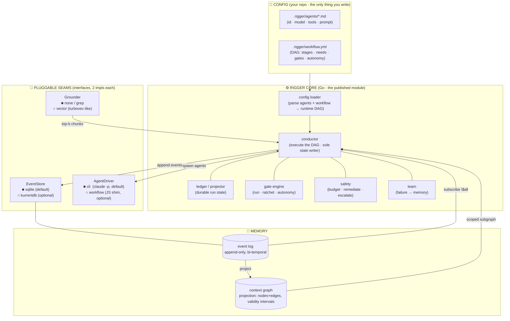
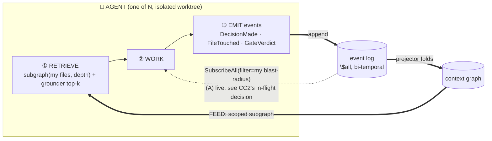

# Rigger: Reference Architecture & Blueprint

> **Status:** Reference architecture. **PROPOSAL (pre-implementation).**
> **Subject:** `Rigger`, a standalone, general-purpose, multi-agent development-loop
> harness, published as a public Go module (`go get github.com/virtual-velocitation/rigger`).
> **Scope:** the complete blueprint to reproduce the harness from scratch: the
> orchestration core, the declarative config model (agent files + workflow YAML),
> the event-sourced + context-graph memory layer, and the two pluggable seams
> (event store, agent driver).
> **Grounded against (2026-06-27):** the tank_game dev-loop harness it generalizes,
> `scripts/dev-loop/*.mjs` (conductor, plan, ledger, gates, autonomy, safety, learn,
> coordinate, turbovec), `.claude/workflows/dev-loop-{fanout,review}.mjs`,
> `.claude/workflows/review-and-remediate.js`, `tools/semantic-retrieval/`,
> `scripts/bd-*.sh`, the review-lens agent definitions, and
> `docs/superpowers/specs/2026-06-23-development-loop-design.md`. Plus the
> context-graph research corpus (Zep/Graphiti temporal KG, the TrustGraph context-graph
> manifesto, GraphRAG-vs-vector findings) and KurrentDB's event-sourcing model.
>
> **This is Rigger's canonical architecture doc.** It was drafted while building the
> tank_game dev-loop it generalizes, then moved into this repo. The proposed records in
> §12 (ADR-0001 + glossary) stay PROPOSALS until ratified at roadmap Phase 0; they are
> not yet written into `docs/adr/`.

---

## How to read this

Sections tagged **[AS-BUILT]** describe the proven tank_game dev-loop harness, the
*prior art* Rigger generalizes (it already runs; it built the engine inversion this
session). Sections tagged **[TARGET]** describe Rigger: the standalone, config-driven,
language-agnostic product. The single sentence that relates them:

> **Rigger is the *machinery* of the tank_game dev-loop, inverted the same way the
> engine was: every project-specific thing (Rust, cargo, bd, e7, Golden Apple) becomes
> user-supplied *content* (agent files, a workflow YAML, gate commands), and Rigger
> itself ships knowing none of it.**

The reader who wants the 5-minute version: §1 (what it is) → §2 (the picture) → §3
(the declarative model) → §5 (the memory ∞). The reader reproducing it: read all of it.

---

## 1. What Rigger is, and what it is not

**Rigger turns a *spec* into *integrated code* by orchestrating a fleet of AI agents,
and it remembers every decision they make in a self-reinforcing context graph so the
next agent is never blind to what the last one decided.** It is the *producing* loop
(spec → code); an adversarial *review* loop is a stage inside it.

**It is:**
- A **single static Go binary** + a **public Go module** (`go get`).
- **Language-/project-agnostic.** It knows nothing about your build tool, test runner,
  tracker, or domain. You bring those as config.
- **Declarative.** The agents are **definition files**; the flow is a **workflow YAML**
  shaped like a GitHub Actions DAG. Reconfiguring the loop is an *edit*, never a recompile.
- **Memory-first.** An embedded **event store** (the append-only truth) projects a
  **bi-temporal context graph** (the queryable map) that scopes each agent's context to
  *exactly* its blast-radius and makes concurrent agents aware of each other's decisions.

**It is NOT:**
- Tied to Claude Code. The default agent driver shells out to the `claude` CLI; running
  *inside* Claude Code (with the Workflow tool) is an *optional* driver, not a requirement.
- Tied to a database server. The default event store is embedded SQLite (zero-dependency,
  single file). KurrentDB is an *optional* backend behind the same interface.
- Opinionated about your gates. A gate is "a command that must exit 0" plus an autonomy
  level. `go test`, `cargo test`, `pytest`, `npm test`, a custom lint: all just YAML.

### The inversion (why "no current config exists")

```
        tank_game dev-loop (AS-BUILT)              Rigger (TARGET)
   ┌─────────────────────────────────┐     ┌──────────────────────────────┐
   │ MACHINERY  (general)            │     │ MACHINERY  →  the Rigger crate │
   │  conductor · ledger · DAG ·     │ ══▶ │  (Go: conductor, eventstore,   │
   │  gates · autonomy · fan-out ·   │     │   contextgraph, drivers, …)    │
   │  review · context-graph(new)    │     └──────────────────────────────┘
   ├─────────────────────────────────┤     ┌──────────────────────────────┐
   │ CONTENT   (Golden-Apple-specific)│ ══▶ │ CONTENT  →  YOUR repo's config │
   │  cargo/e7 gates · bd federation ·│     │  agents/*.md · .rigger/*.yml · │
   │  Rust turbovec corpus · review   │     │  gate commands · grounding src │
   │  lenses · the S1 spec            │     │  (tank_game becomes one EXAMPLE)│
   └─────────────────────────────────┘     └──────────────────────────────┘
```

The tank_game harness already proved the machinery (it drove the ADR-0008 engine
inversion). Rigger is that machinery with the content cut out and replaced by a config
surface.

---

## 2. Architecture at a glance  **[TARGET]**



**Two hard seams, one philosophy:** *the core depends on interfaces; the impls are
swapped by config:*

| Seam | Interface | Default impl | Optional impl | Why pluggable |
|---|---|---|---|---|
| **EventStore** | append / read / subscribe / position | `sqlite` (embedded, 1 file) | `kurrentdb` (gRPC server) | local zero-dep dev vs. multi-machine / scale; KurrentDB-shaped so the *test* of the embedded impl is a faithful proxy for the server |
| **AgentDriver** | `Spawn(agent, prompt, opts) → result` | `cli` (`claude -p`, subprocess) | `workflow` (JS Workflow shim) | self-contained `go get` install vs. in-Claude-Code parallel/journal/resume |
| **Grounder** | `Ground(query) → []ref` | `nop` / `grep` | `vector` (local embeddings) | a project may want semantic grounding (turbovec-style) or none |

---

## 3. The declarative model: the heart of "reconfigure by editing, not coding"  **[TARGET]**

Two file kinds, both in the *consuming* repo. Rigger reads them; it ships neither.

### 3.1 Agent definition files: `.rigger/agents/<id>.md`

Markdown-with-YAML-frontmatter (the format the tank_game review lenses already use,
`.claude/agents/*.md`), so existing agent defs port verbatim.

```markdown
---
id: implementer
model: sonnet
tools: [Read, Edit, Write, Grep, Glob, Bash]
isolation: worktree          # run in an isolated git worktree
recurse: false               # no Agent tool ⇒ cannot fan out (runaway-proof)
---
You implement ONE fully-specified finding inside your worktree. Write the failing
test first, confirm RED, implement minimally, confirm GREEN, run the named gates,
commit, push. Report the final line as JSON: {"id","pass","evidence"}.
```

```markdown
---
id: reviewer.architecture
model: sonnet
tools: [Read, Grep, Glob, Bash, LSP]
isolation: none
---
You review a diff for architectural defects ONLY. Quote the rule/doc violated.
Output the REVIEW schema: {verdict, issues:[{title,file_line,reason}]}.
```

The agent file is a **pure capability + persona declaration**, with no flow logic. The flow
references it by `id`.

### 3.2 The workflow YAML: `.rigger/workflow.yml`

GitHub-Actions-shaped: a DAG of **stages**, each with `needs:` edges, each binding an
**agent**, optional **gates**, and an **autonomy** level. *This* is the loop: the thing
that is hardcoded as `ground→plan→red→green→verify→review→integrate` in the tank_game
conductor becomes data anyone can rewrite.

```yaml
# .rigger/workflow.yml - a GitHub-Actions-style DAG for the producing loop
name: produce-from-spec
on: { spec: { path: "specs/**.md" } }      # what kicks off a run

defaults:
  autonomy: manual                          # manual | auto_notify | silent
  grounder: vector

gates:                                      # reusable gate library (commands)
  build:   { run: "go build ./...",                 kind: core }
  test:    { run: "go test ./...",                  kind: core }
  lint:    { run: "golangci-lint run",              kind: elevated }
  custom:  { run: "./scripts/my-invariant.sh",      kind: elevated }

stages:
  plan:
    agent: planner
    produces: dag                           # decomposes the spec into a unit DAG
    coverage: required                      # block if a spec criterion has no unit

  implement:
    needs: [plan]
    agent: implementer
    strategy: fan-out                       # one agent per ready unit, in worktrees
    partition: by-blast-radius              # disjoint batches → safe parallelism
    gates: [build, test]                    # red→green enforced around these

  review:
    needs: [implement]
    strategy: fan-out
    agents: [reviewer.architecture, reviewer.technical]   # the lenses
    adjudicator: devils-advocate            # adversarial pass; verdict gates the stage
    autonomy: manual

  integrate:
    needs: [review]
    gates: [build, test, lint, custom]
    on_pass: merge                          # land + reindex + record
```

**The YAML → runtime mapping** (loader, §4.1): each `stage` becomes a node in the run
DAG; `needs` are the edges; `strategy: fan-out` + `partition` triggers the partitioner +
the AgentDriver per unit; `gates` are looked up in the `gates:` library and run via the
gate engine; `autonomy` seeds that gate/stage's ratchet. A stage with `produces: dag`
runs an agent whose output *extends* the run DAG (the living-DAG / `spawnUnit` mechanic).

### 3.3 Gates are config, not code

A gate is `{ run: <command>, kind: core|elevated|deferred }`. Rigger runs it, captures a
**compact summary** (verdict + ≤5 failing lines, capped), never the raw log, and feeds
that to the autonomy ratchet. `cargo test` / the e7 lexical check / `pytest` are all just
entries in a project's `gates:` map. Rigger ships **zero** gates.

---

## 4. The execution model: the conductor  **[TARGET, generalizing AS-BUILT]**

### 4.1 The pipeline, now *declared*

[AS-BUILT] the tank_game conductor hardcodes `Intake → Loop-readiness → Ground → Plan →
Coverage → Partition → Fan-out → Verify+Review → Integrate → Converge`
(`conductor.mjs`, `runLoop`). [TARGET] Rigger executes whatever DAG the workflow YAML
declares; the canonical pipeline above is simply the *default* workflow shipped as an
example.

```mermaid
flowchart LR
  S["spec"] --> RDY{loop-ready?\n(enumerable\nDone-when criteria)}
  RDY -->|no| BLK1["block: ask for criteria"]
  RDY -->|yes| G["ground each unit (JIT)\nvector + context-graph subgraph"]
  G --> P["run the DAG stage-by-stage\n(needs = edges)"]
  P --> COV{coverage gate\nevery criterion has a unit?}
  COV -->|gap| BLK2["block: plan missed a requirement"]
  COV -->|ok| PAR["partition ready units\n(disjoint by blast-radius)"]
  PAR --> FAN["fan-out: AgentDriver per unit\n(red → green → gates)"]
  FAN --> VR["verify + review\n(lenses → adjudicator)"]
  VR --> INT["integrate\ncommit · land · emit events · reindex"]
  INT --> CONV{converged?\nall criteria covered +\nall units integrated +\nall gates green}
  CONV -->|no| G
  CONV -->|yes| DONE["done (machine-verified)"]
```

**"done" is a machine-verifiable predicate:** every spec criterion covered + every unit
integrated + every gate green. Never "looks done."

### 4.2 Durable state: the ledger *is* a projection of the event log

[AS-BUILT] tank_game keeps a JSON ledger written solely by the Conductor; executors
append to a `.buffer` and the Conductor `drain()`s it (one-mutation-authority §6.8).
[TARGET] Rigger keeps that one-writer discipline but makes the ledger a **projection of
the event log** (§5): the run's state (units, coverage, gate history, autonomy) is
*derived* by folding the events, so a crashed/compacted run resumes by replaying. The
Conductor is the sole writer of *projections*; agents only ever *append events*.

```go
// the conductor owns the run; agents never mutate shared state directly
type RunState struct {
    Task     TaskRef
    DAG      []Unit                 // the living unit DAG
    Coverage []CriterionCoverage
    Gates    map[string]GateState   // id → {autonomy, history}
    Budget   Budget
}
type Unit struct {
    ID            string
    SpecCriterion string                // every unit maps to a criterion (anti-fragmentation)
    DependsOn     []string
    Status        UnitStatus            // pending→grounding→red→green→verified→reviewed→integrated | failed | escalated
    Worktree, Branch string
    Evidence      map[string]string     // red/green/verify/review summaries
    Attempts      int
}
```

### 4.3 The autonomy ratchet (bidirectional, self-correcting)

Per gate: `manual → auto_notify → silent` on N consecutive clean passes (proposed, never
auto-applied); any non-manual gate that **fails** auto-demotes to `manual`. Autonomy
tracks demonstrated reliability: a graduated gate can never become a silent hole that
auto-passes bad work. The async manual-gate queue lets *independent* units advance while
one waits on a human. (Direct port of `autonomy.mjs`.)

### 4.4 Safety rails

`checkBudget` (token/time circuit-breaker → pause), `remediate` (bounded retry with
re-grounding → escalate after N), `flagSpecDefect` (halt + amend the spec, don't
deviate), `abortTask` (discard un-integrated worktrees, keep integrated). Never silent,
never infinite. (Port of `safety.mjs`.)

---

## 5. The memory layer: event source + context graph  **[TARGET: the new heart]**

This is what the tank_game harness does *not* have and what makes Rigger more than a
port. The model, in one line: **agents append immutable events to a log; a projector
folds the log into a bi-temporal context graph; agents retrieve their connected subgraph
and subscribe for in-flight decisions.**

### 5.1 The event store: KurrentDB-shaped, embedded by default

The interface mirrors KurrentDB's primitives so the embedded SQLite impl is a faithful
*test proxy* for the real server; swapping backends is a config flip, not an
architecture change.

```go
package eventstore

// Mirrors KurrentDB: append-only streams, a global $all order, catch-up subscriptions.
type EventStore interface {
    // Append events to a stream with optimistic concurrency (expectedVersion).
    Append(ctx context.Context, stream string, expected Version, events ...Event) (Position, error)
    // Read a single stream forward/backward from a revision.
    ReadStream(ctx context.Context, stream string, from Revision, dir Direction) (Iterator, error)
    // Read the global $all stream (every event, globally ordered): the projector's input.
    ReadAll(ctx context.Context, from Position, dir Direction) (Iterator, error)
    // Catch-up subscription: replay history from `from`, then stream live appends.
    // This is the (A) live-awareness mechanism: a running agent's side-car watches $all.
    SubscribeAll(ctx context.Context, from Position, filter Filter) (Subscription, error)
    SubscribeStream(ctx context.Context, stream string, from Revision) (Subscription, error)
}

type Event struct {
    ID         string            // idempotency key
    Stream     string            // e.g. "run-<id>", "decision-<unit>", "agent-<id>"
    Type       string            // "DecisionMade", "FileTouched", "GateVerdict", "UnitIntegrated", …
    Data       json.RawMessage   // the payload (see §5.3)
    Meta       map[string]string // causation/correlation ids, actor
    ValidFrom  time.Time         // bi-temporal: when the fact became true (caller-supplied)
    RecordedAt time.Time         // bi-temporal: when the store ingested it (store-stamped)
    Position   Position          // global order (assigned on append)
    Revision   Revision          // per-stream order
}
```

**Two impls, one interface:**
- **`sqlite` (default).** One table `events(position INTEGER PK AUTOINCREMENT, stream,
  type, data, meta, valid_from, recorded_at, revision)`. `$all` = `ORDER BY position`.
  A per-stream `(stream, revision)` unique index gives optimistic concurrency.
  **Subscriptions** = a long-poll/`WATCH` on `MAX(position)` (SQLite WAL makes tailing
  cheap); at Rigger's event volume (hundreds to thousands of events per run) this is
  trivial. Zero external dependency; the whole store is one file.
- **`kurrentdb` (optional).** A thin adapter over the official KurrentDB Go client:
  `Append`→`AppendToStream`, `ReadAll`→`$all` read, `SubscribeAll`→a catch-up
  subscription. Selected by `eventstore: { driver: kurrentdb, conn: "esdb://…" }`.

Because the interface *is* the KurrentDB model, the SQLite impl's test suite (append
ordering, optimistic-concurrency conflicts, catch-up replay-then-live) doubles as the
contract test the KurrentDB adapter must also pass: the proxy fidelity you asked for.

### 5.1.1 Per-project segregation (one mechanism, every backend)

Event streams and the context graph are **scoped to one project by default**, never shared. `go get` installs the rigger *binary* into a shared `$GOBIN`, but its *data* is always project-local, enforced by **one mechanism for every backend**, not a different trick per store: a **project namespace applied to stream names**, via a single scoping decorator over the `EventStore` port.

- The decorator prefixes every stream a project writes with its namespace, and filters every read/subscribe by it (stripping the prefix from returned events, so callers see clean stream names). It is written once and wraps *any* `EventStore`; the backends are namespace-unaware.
- **SQLite** realizes the filter on the `stream` column (`WHERE stream LIKE 'ns-%'`); its `.rigger/` directory is just the default storage path, not the isolation mechanism.
- **KurrentDB** realizes the same prefix as a server-side `$all` filter (it supports filtered catch-up subscriptions natively), so one server backs many projects, each seeing only its own events against its own checkpoint.
- The namespace **defaults to the project identity**, so isolation is the default. A hard boundary (security or multi-tenant) is just config: a dedicated SQLite file, or a dedicated KurrentDB instance.

This is dependency inversion (R8) paying off directly: because the decorator depends on the `EventStore` *interface*, segregation is one implementation for all backends. And the **context graph is always a local, per-project projection**, rebuilt into `.rigger/` from the namespaced stream whatever the log backend, so even a shared KurrentDB server never shares a graph.

### 5.2 The context graph: a bi-temporal projection

The graph is a **read model** the projector maintains by folding `$all`. Rigger ships the
projection as **SQLite tables** (one store, no extra engine; subgraph traversal via
recursive CTEs); `Kuzu` (embedded graph + Cypher) is a drop-in alternative behind the
same `GraphProjection` interface if traversal richness ever demands it.

```go
type Node struct {
    ID    string            // stable id (entity-resolved)
    Kind  string            // "decision" | "artifact" | "agent" | "lesson" | "gate" | "unit"
    Attrs map[string]string
}
type Edge struct {
    From, To  string
    Rel       string        // "DECIDED" | "SUPERSEDES" | "TOUCHES" | "GOVERNS" | "BLOCKS" | "ASSIGNED_TO"
    ValidFrom time.Time     // bi-temporal validity interval …
    ValidTo   *time.Time    // … nil = still valid; set = invalidated (NOT deleted)
    Source    Position      // the event that asserted this edge (provenance)
}
type GraphProjection interface {
    Apply(Event) error                              // fold one event (the projector loop)
    Subgraph(seed []string, depth int) (Graph, error) // the FEED arc: connected blast-radius
    Resolve(mention string) (nodeID string, ok bool)  // entity resolution (alias table)
}
```

**Three properties carried from the research:**
1. **Bi-temporal freshness (Zep/Graphiti).** Supersession sets `ValidTo` on the old edge
   and appends a new one: the graph shows the *current* truth, the log keeps the
   *history*, and a stale fact never surfaces with false confidence. (e.g. a
   `collapse-decision` edge's `ValidTo` is stamped when the `split-decision` supersedes it.)
2. **Entity resolution (Graphiti / the TDS alias-table bug).** `Resolve` collapses
   `"the editor" ≡ "content-editor" ≡ "velocity-engine"` to one node on ingest, so
   retrieval joins instead of fragmenting.
3. **Scoped retrieval (GraphRAG).** `Subgraph(seed, depth)` returns the *connected
   subgraph* of an agent's blast-radius (ALL & ONLY its context), not a chunk dump.

### 5.3 The ∞ loop: emit, project, retrieve



**The (A) live awareness, concretely.** An agent's run is wrapped by a Rigger **side-car**
that holds a `SubscribeAll` filtered to the agent's blast-radius. When a *concurrent*
agent appends a `DecisionMade` touching a shared node, the side-car surfaces it to the
agent at its next tool-boundary (a context refresh injected before the next action). This
gives true in-flight awareness **without** touching the agent's files: isolation guards
the *files* (worktree), the event stream is the *separate shared decision channel*. The
two are orthogonal (the insight that makes (A) safe).

### 5.4 Grounding stays hybrid (vector + graph)

[AS-BUILT] `turbovec` is local code+memory vector search (`tools/semantic-retrieval`).
[TARGET] Rigger keeps a pluggable **`Grounder`** (vector is *one* impl) for fuzzy
"find things like this" and adds the **graph** for "what decisions govern these files / who
else touches these nodes": the multi-hop questions vector RAG structurally can't answer.
The research is unanimous the winner is *both*: vector for the fast first pass, graph for
relationships.

---

## 6. The agent driver: pluggable spawning  **[TARGET]**

```go
type AgentDriver interface {
    // Spawn runs one agent to completion and returns its result.
    Spawn(ctx context.Context, a AgentDef, prompt string, opts SpawnOpts) (AgentResult, error)
}
type SpawnOpts struct {
    Isolation Isolation   // none | worktree
    Parallel  bool        // hint; the cli driver runs goroutines, the workflow driver uses parallel()
}
```

- **`cli` (default, self-contained).** Spawns `claude -p <prompt> --model <m> --allowed-tools <…>`
  as a subprocess, parses the final JSON line. Worktree isolation is Rigger's own:
  `git worktree add` before, harvest the pushed branch + remove after. **No Claude-Code
  runtime assumption: works for any `go get` user with the `claude` CLI on PATH.** Fan-out
  = a bounded goroutine pool (default 4, matching the tank_game cap) over disjoint units.
- **`workflow` (optional).** Runs inside Claude Code to keep the Workflow tool's built-in
  parallelism / journaling / resume. The Workflow sandbox cannot shell out to a binary, so
  the bridge is **MCP, not a subprocess**: `rigger serve` runs the conductor and serves an
  MCP server exposing `rigger_next` / `rigger_result` / `rigger_emit`. A thin Workflow shim
  loops - `rigger_next` for the next spawn, `agent()` to run it in-process, `rigger_result`
  to report it - while agents record decisions live by calling `rigger_emit`. The Go core is
  identical; only the spawn seam changes. See [driver/workflow/README.md](../driver/workflow/README.md).

**Runaway-proof by construction** (carried from the fan-out lesson): the implementer agent
def declares `recurse: false` (no Agent/Spawn capability), and units are partitioned
disjoint, so parallel worktrees cannot conflict and an agent cannot fan out.

---

## 7. Worked example: the modifier saga through Rigger

The real episode from this session, replayed as Rigger would record it. A unit
"genericize the modifier pipeline" runs; here is the **event log** it appends and the
**graph** that results.

```jsonc
// stream "run-7", appended over the unit's life (Position grows globally)
{ "type":"UnitStarted",   "data":{"unit":"mod","criterion":"engine names no game concept"} }
{ "type":"Grounded",      "data":{"refs":["modifier.rs","FoldRule","GA_STAGES"]} }
{ "type":"DecisionMade",  "data":{"id":"mod-collapse","summary":"move whole modifier to ga-*"},
  "validFrom":"…T10:00Z" }
// … owner rejects; the split decision supersedes the collapse …
{ "type":"DecisionMade",  "data":{"id":"mod-split","summary":"generic FoldRule pipeline in engine, GA taxonomy on top",
  "supersedes":"mod-collapse"}, "validFrom":"…T11:30Z" }
{ "type":"FileTouched",   "data":{"path":"engine-schema/src/modifier.rs"} }
{ "type":"GateVerdict",   "data":{"gate":"e7","pass":true,"evidence":"TOTAL 0"} }
{ "type":"GateVerdict",   "data":{"gate":"test","pass":true,"evidence":"54 passed"} }
{ "type":"UnitIntegrated","data":{"unit":"mod","commit":"f848b97"} }
```

The projector folds these into the graph:

```
(decision mod-collapse) --SUPERSEDES(validTo=11:30)--> ✗        ← invalidated, not deleted
(decision mod-split)    --GOVERNS--> (artifact modifier.rs)
(artifact modifier.rs)  --GATED_BY--> (gate e7)
(agent impl-mod)        --DECIDED--> (decision mod-split)
```

**The payoff, concretely:** the *next* agent that touches `modifier.rs` calls
`Subgraph(["modifier.rs"], 2)` and is handed `mod-split` (current), **not** `mod-collapse`
(invalidated), plus the `e7` gate that governs the file, plus the no-named-bridge lesson
linked to the engine crate. It cannot re-litigate the collapse, re-invent a gate-dodge, or
work a stale base: the three failure classes this session hit, closed structurally.

---

## 8. Edge cases & failure modes

| Failure | Handling |
|---|---|
| Spec has no enumerable Done-when criteria | `loop-ready` gate blocks; ask the human to add them (never guess "done") |
| A discovered unit has no `spec_criterion` | `spawnUnit` refuses + emits a `scope_creep` event (anti-fragmentation) |
| A conceptual criterion covered only by a mechanical gate | `coverage` proxy-gap guard ⇒ NOT covered; demands a real (LLM-judge) verifier |
| Two concurrent units edit the same file | Partitioner makes batches disjoint by blast-radius; they never share a worktree |
| Agent crashes / hits usage limit mid-spawn | `cli` driver: non-zero exit → `remediate` (bounded retry, re-grounded) → escalate |
| Stale base (a peer landed while I ran) | Integrate does `pull --rebase` + re-runs gates; the graph's `TOUCHES` edges flag the overlap pre-merge |
| Event store append conflict (optimistic concurrency) | `expectedVersion` mismatch → re-read stream, re-project, retry the append |
| Projector falls behind / crashes | The graph is a *pure projection*: rebuild it from `$all` from position 0 (event sourcing's superpower); idempotent |
| Superseded decision still in the graph | Bi-temporal `ValidTo` set on supersession; `Subgraph` filters `ValidTo IS NULL` by default |
| Entity mention doesn't resolve | `Resolve` miss ⇒ create a new node + log an `alias_unresolved` event for later merge (never silently drop) |
| KurrentDB unreachable (optional backend) | Fail fast at startup with a clear error; the `sqlite` default never has this failure mode |
| Gate command itself errors (not just fails) | Gate engine wraps the run; a throwing command ⇒ `{pass:false, evidence:"gate errored: …"}`; never crashes the loop |
| Budget exhausted mid-run | `checkBudget` circuit-breaker pauses; resume by replaying the ledger projection |

---

## 9. Data model / schemas (consolidated)

- **Event:** §5.1 (`Stream, Type, Data, Meta, ValidFrom, RecordedAt, Position, Revision`).
- **Graph Node / Edge:** §5.2 (Edge carries the bi-temporal `ValidFrom/ValidTo` + `Source` provenance).
- **RunState / Unit:** §4.2 (the projected ledger).
- **AgentDef:** §3.1 frontmatter (`id, model, tools, isolation, recurse, prompt`).
- **Workflow:** §3.2 (`name, on, defaults, gates{}, stages{needs, agent(s), strategy, partition, gates, adjudicator, autonomy, on_pass}`).
- **Gate:** `{run, kind: core|elevated|deferred}` + runtime `{autonomy, history:[{result,decision}]}`.

---

## 10. Repo layout & `go get` usage  **[TARGET]**

```
github.com/virtual-velocitation/rigger
├── go.mod                       module github.com/virtual-velocitation/rigger
├── cmd/rigger/                  the CLI binary (main)
├── conductor/                   the DAG executor + run loop
├── eventstore/                  EventStore iface
│   ├── sqlite/                  default impl (embedded)
│   └── kurrentdb/               optional impl (adapter)
├── contextgraph/                GraphProjection iface + sqlite projector (+ kuzu/ alt)
├── driver/                      AgentDriver iface
│   ├── cli/                     default (claude -p)
│   └── workflow/                optional (JS Workflow shim generator)
├── grounder/                    Grounder iface (nop, grep, vector)
├── config/                      agent-file + workflow-YAML loader → runtime DAG
├── gate/  autonomy/  safety/  learn/    the rails (ports of the .mjs modules)
└── examples/
    └── golden-apple/            tank_game's setup as a worked EXAMPLE (agents + workflow.yml)
```

```bash
go install github.com/virtual-velocitation/rigger/cmd/rigger@latest

cd my-project
rigger init                         # scaffolds .rigger/workflow.yml + .rigger/agents/
rigger run specs/feature.md         # runs the producing loop on a spec
rigger run --driver workflow …      # opt into the JS Workflow shim (inside Claude Code)
rigger run --eventstore kurrentdb … # opt into the server backend
rigger graph --around modifier.rs   # inspect the context graph (subgraph query)
```

Library use (embed the harness) is the same packages imported directly.

---

## 11. What carries over vs. what's new

| tank_game module **[AS-BUILT]** | Rigger **[TARGET]** | Change |
|---|---|---|
| `ledger.mjs` | `conductor` + event projection | ledger becomes a projection of the log |
| `conductor.mjs` (hardcoded pipeline) | `conductor` executing the workflow DAG | pipeline becomes declared YAML |
| `plan.mjs` (DAG, coverage, partition) | `conductor` (same logic, Go) | direct port |
| `gates.mjs` | `gate` + the YAML `gates:` library | gates become config |
| `autonomy.mjs`, `safety.mjs`, `learn.mjs` | same names, Go | direct ports |
| `turbovec.mjs` + `tools/semantic-retrieval` | `grounder` (vector impl) | generalized + pluggable |
| `bd-*.sh` federation memory | the event log + context graph | replaced by event-sourced memory (the new core) |
| `dev-loop-fanout` / `dev-loop-review` (JS Workflows) | `driver/cli` (default) or `driver/workflow` | spawning becomes a pluggable seam |
| review lenses, e7 gate, S1 spec | `examples/golden-apple/` | demoted to a worked example |
| (none) | **event store + bi-temporal context graph + (A) subscriptions** | **net-new** |

---

## 12. Records to ratify during execution

> These are **Rigger's** future records (created in the *rigger* repo at Phase 0), embedded
> here as proposals. **Do not** write them into tank_game's `adr/` or `ubiquitous-language.md`.

### Proposed `rigger/docs/adr/0001-rigger-architecture.md`

```markdown
# ADR-0001: Rigger, a config-driven, event-sourced multi-agent dev-loop harness

- Status: Proposed
- Context: We need a standalone, publishable harness that turns a spec into integrated
  code via a fleet of AI agents, generalized from the tank_game dev-loop, owning none of
  any consumer's project specifics.
- Decision: Rigger is governed by:
  - R1 CONFIG-OVER-CODE: agents are definition files; the flow is a workflow YAML (a DAG);
    gates are commands. Reconfiguring the loop never recompiles the binary.
  - R2 EVENT-SOURCED MEMORY: an append-only event log is the single source of truth; all
    run state and the context graph are projections folded from it (rebuildable, resumable).
  - R3 BI-TEMPORAL CONTEXT GRAPH: decisions are first-class nodes with validity intervals;
    superseded facts are invalidated, never deleted; retrieval returns a connected subgraph,
    not a chunk dump.
  - R4 PLUGGABLE SEAMS: EventStore (sqlite default | kurrentdb), AgentDriver (cli default |
    workflow), Grounder (nop|grep|vector) are interfaces chosen by config; the core depends
    only on the interfaces.
  - R5 ORTHOGONAL ISOLATION: worktree isolation guards FILES; the event stream is the shared
    DECISION channel; live cross-agent awareness never crosses the file boundary.
  - R6 MACHINE-VERIFIABLE DONE: every spec criterion covered + every unit integrated + every
    gate green; failures escalate or bounded-retry, never silently drop, never infinite-spin.
  - R7 SELF-CONTAINED PUBLISH: `go get`-installable; no runtime dependency on Claude Code or a
    database server in the default configuration.
  - R8 CLEAN ARCHITECTURE + DI: ports (EventStore/GraphProjection/AgentDriver/Grounder) are
    interfaces; sqlite/kurrentdb/cli/workflow are adapters that depend inward; use cases depend
    only on ports; a single composition root (`cmd/rigger`) constructs the concrete adapters and
    injects them. No globals, no package-level singletons, no type building its own dependencies.
    Idiomatic Go throughout: small interfaces, accept interfaces and return concrete types, errors
    as values, one responsibility per package, no premature abstraction.
  - R9 PROJECT-SCOPED DATA, ONE MECHANISM: event streams and the context graph are segregated per
    project by a single scoping decorator over the EventStore port, a project namespace applied to
    stream names, identical for every backend (SQLite filters the `stream` column; KurrentDB filters
    `$all` server-side). The shared `go get` binary never implies shared data; the graph is always a
    local, per-project projection.
- Consequences: a hardcoded flow, a project-specific concept baked into the core, a mutable
  (non-event-sourced) source of truth, a deleted-not-invalidated fact, a default that requires a
  server/IDE, a use case that depends on a concrete adapter instead of a port, or a second
  segregation mechanism are defects.
```

### Proposed Rigger glossary rows (`rigger/docs/glossary.md`, status `pending ADR-0001`)

| Term | Meaning |
|---|---|
| **Workflow** | the YAML DAG that declares the loop's stages, deps, gates, autonomy |
| **Agent def** | a markdown+frontmatter file declaring one agent's model/tools/prompt |
| **Gate** | a command + kind + autonomy; the unit of verification |
| **Event** | an immutable, bi-temporal fact appended to the log (the source of truth) |
| **Context graph** | the projected, bi-temporal node/edge read model of decisions+artifacts |
| **Driver** | the pluggable agent-spawning backend (cli \| workflow) |
| **Side-car** | the per-agent subscription that delivers in-flight cross-agent decisions |

---

## 13. Phased delivery roadmap

Each phase lands independently and is demoable. **Task 0 = ratify the records.**

- **Phase 0: Repo + records.** Create the public `github.com/virtual-velocitation/rigger`
  repo; `go mod init`; move this blueprint to `docs/architecture.md`; **ratify ADR-0001 +
  the glossary** (Task 0). *Done when:* `go get` resolves an empty module + the ADR is committed.
- **Phase 1: Event store.** `EventStore` interface + `sqlite` impl + a contract test suite
  (append ordering, optimistic-concurrency conflict, catch-up replay-then-live). *Done when:*
  the contract tests pass against `sqlite`.
- **Phase 2: KurrentDB adapter.** `kurrentdb` impl passing the *same* contract tests.
  *Done when:* the proxy fidelity is proven (one suite, two backends green).
- **Phase 3: Context graph.** `GraphProjection` + sqlite projector: fold events → nodes/edges,
  bi-temporal supersession, entity resolution, `Subgraph`. *Done when:* the modifier-saga
  fixture (§7) projects correctly and `Subgraph` returns `mod-split`, not `mod-collapse`.
- **Phase 4: Config loader.** Parse agent files + workflow YAML → runtime DAG; validate.
  *Done when:* the `examples/golden-apple` config loads into a DAG.
- **Phase 5: Conductor + rails.** The DAG executor + ledger projection + gate engine +
  autonomy + safety (ports). *Done when:* a trivial 2-stage workflow runs end-to-end with a
  stub driver.
- **Phase 6: CLI driver + worktrees + side-car.** `driver/cli` (claude -p), git-worktree
  isolation, the live subscription side-car. *Done when:* a real spec produces an integrated
  commit, and a concurrent decision is observed in-flight.
- **Phase 7: Workflow driver + grounder(vector) + polish.** The optional JS shim, the vector
  grounder, `rigger init/run/graph`, README/examples. *Done when:* `go install … && rigger run`
  works from a clean machine; both drivers + both event stores are switchable by flag.

---

## 14. Glossary & cross-references

See §12 for Rigger's own glossary. This blueprint inherits its discipline from the tank_game
dev-loop design (`docs/superpowers/specs/2026-06-23-development-loop-design.md`) and the
context-graph research (Zep/Graphiti, the TrustGraph context-graph manifesto, GraphRAG-vs-vector).
KurrentDB's model (`github.com/kurrent-io/KurrentDB`) is the interface blueprint for `eventstore`.

---

*End of reference architecture. This is a PROPOSAL: nothing here is ratified until Phase 0,
and the rigger repo does not yet exist. Review gate next; see the hand-off.*
