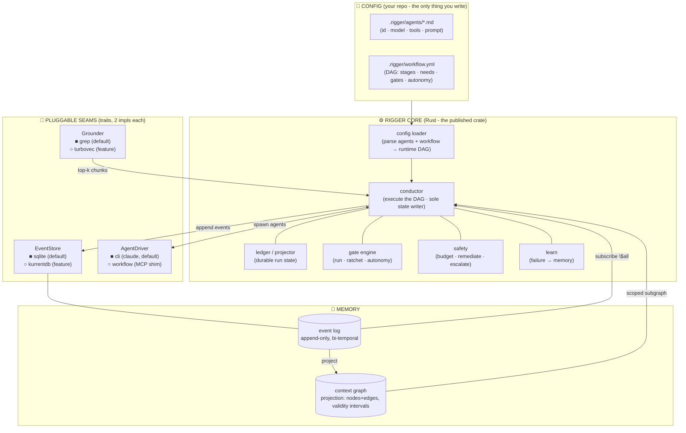
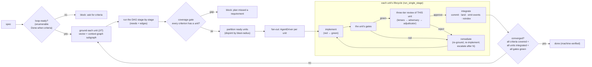
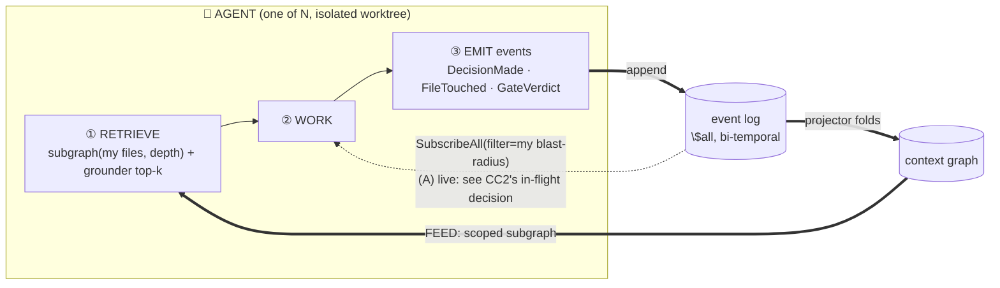

# Rigger: Reference Architecture & Blueprint

> **Status:** Reference architecture. **[AS-BUILT] (implemented in Rust).**
> **Subject:** `Rigger`, a standalone, general-purpose, multi-agent development-loop
> harness, published as a public Rust crate (`cargo install --git https://github.com/virtual-velocitation/rigger`).
> **Scope:** the complete blueprint to reproduce the harness from scratch: the
> orchestration core, the declarative config model (agent files + workflow YAML),
> the event-sourced + context-graph memory layer, and the two pluggable seams
> (event store, agent driver).
> **Grounded against (2026-06-27):** the context-graph research corpus (Zep/Graphiti
> temporal KG, the TrustGraph context-graph manifesto, GraphRAG-vs-vector findings)
> and KurrentDB's event-sourcing model.
>
> **This is Rigger's canonical architecture doc.** The proposed records in §12
> (ADR-0001 + glossary) stay PROPOSALS until ratified at roadmap Phase 0; they are
> not yet written into `docs/adr/`.

---

## How to read this

Sections tagged **[AS-BUILT]** describe what the Rigger crate now implements: what a
section specifies is code you can read under `src/`. The single sentence that frames
the whole design:

> **Rigger is dev-loop *machinery* with the project cut out: every project-specific
> thing (a particular language, build tool, memory system, gate, or codebase) is
> user-supplied *content* (agent files, a workflow YAML, gate commands), and Rigger
> itself ships knowing none of it.**

The reader who wants the 5-minute version: §1 (what it is) → §2 (the picture) → §3
(the declarative model) → §5 (the memory ∞). The reader reproducing it: read all of it.

---

## 1. What Rigger is, and what it is not

**Rigger turns a *spec* into *integrated code* by orchestrating a fleet of AI agents,
and it remembers every decision they make in a self-reinforcing context graph so the
next agent is never blind to what the last one decided.** It is the *producing* loop
(spec → code); an adversarial *review* loop is a stage inside it.

**It is:**
- A **single Rust binary** (cargo-installable) + a **public Rust crate** (`cargo install --git …` / a library dependency).
- **Language-/project-agnostic.** It knows nothing about your build tool, test runner,
  tracker, or domain. You bring those as config.
- **Declarative.** The agents are **definition files**; the flow is a **workflow YAML**
  shaped like a GitHub Actions DAG. Reconfiguring the loop is an *edit*, never a recompile.
- **Memory-first.** An embedded **event store** (the append-only truth) projects a
  **bi-temporal context graph** (the queryable map) that scopes each agent's context to
  *exactly* its blast-radius and makes concurrent agents aware of each other's decisions.

**It is NOT:**
- Tied to Claude Code. The default agent driver shells out to the `claude` CLI; running
  *inside* Claude Code (with the Workflow tool) is an *optional* driver, not a requirement.
- Tied to a database server. The default event store is embedded SQLite (zero-dependency,
  single file). KurrentDB is an *optional* backend behind the same trait, built and shipped
  behind the `kurrentdb` cargo feature.
- Opinionated about your gates. A gate is "a command that must exit 0" plus an autonomy
  level. `cargo test`, `go test`, `pytest`, `npm test`, a custom lint: all just YAML.

### The machinery / content split (why "no current config exists")

```
        what any dev loop contains                 where it lives in Rigger
   ┌─────────────────────────────────┐     ┌──────────────────────────────┐
   │ MACHINERY  (general)            │     │ MACHINERY  →  the Rigger crate │
   │  conductor · ledger · DAG ·     │ ══▶ │  (Rust: conductor, eventstore, │
   │  gates · autonomy · fan-out ·   │     │   contextgraph, drivers, …)    │
   │  review · context-graph         │     └──────────────────────────────┘
   ├─────────────────────────────────┤     ┌──────────────────────────────┐
   │ CONTENT   (project-specific)    │ ══▶ │ CONTENT  →  YOUR repo's config │
   │  project gates · project        │     │  agents/*.md · .rigger/*.yml · │
   │  memory · code corpus · review  │     │  gate commands · grounding src │
   │  lenses · the spec              │     │  (this repo is one EXAMPLE)    │
   └─────────────────────────────────┘     └──────────────────────────────┘
```

The split is the whole design: the loop's mechanics are generic and live in the
crate; everything the loop must know about a particular project arrives as that
project's configuration. Nothing in the crate names a language, a build tool, or
a codebase - which is why a fresh checkout of Rigger contains no working config,
only the machinery and a worked example.

---

## 2. Architecture at a glance  **[AS-BUILT]**



**Two hard seams, one philosophy:** *the core depends on traits; the impls are
swapped by config / cargo feature:*

| Seam | Trait | Default impl | Optional impl | Why pluggable |
|---|---|---|---|---|
| **EventStore** | `append` / `read_stream` / `read_all` / `subscribe_all` | `sqlite` (embedded, 1 file) | `kurrentdb` (gRPC server, `kurrentdb` feature) | local zero-dep dev vs. multi-machine / scale; KurrentDB-shaped so the *contract suite* of the embedded impl is a faithful proxy for the server |
| **AgentDriver** | `spawn(agent, prompt, opts, emit) → result` | `cli` (`claude` subprocess) | `workflow` (MCP shim) | self-contained `cargo install` vs. in-Claude-Code parallel/journal/resume |
| **Grounder** | `ground(query, k) → Vec<Ref>` | `grep` (default) / `Nop` | `turbovec` (native vector search, `turbovec` feature) | a project may want semantic grounding (turbovec) or none |

---

## 3. The declarative model: the heart of "reconfigure by editing, not coding"  **[AS-BUILT]**

Two file kinds, both in the *consuming* repo. Rigger reads them; it ships neither.

### 3.1 Agent definition files: `.rigger/agents/<id>.md`

Markdown-with-YAML-frontmatter - the same shape as Claude Code subagent definitions
(`.claude/agents/*.md`) - so an agent definition you already maintain for your
harness drops in verbatim.

```markdown
---
id: implementer
model: sonnet
tools: [Read, Edit, Write, Grep, Glob, Bash]
isolation: worktree          # run in an isolated git worktree
recurse: false               # no Agent tool ⇒ cannot fan out (runaway-proof)
---
You implement ONE fully-specified finding inside your worktree. Write the failing
test first, confirm RED, implement minimally, confirm GREEN, run the named gates,
commit, push. Report the final line as JSON: {"id","pass","evidence"}.
```

```markdown
---
id: reviewer.architecture
model: sonnet
tools: [Read, Grep, Glob, Bash, LSP]
isolation: none
---
You review a diff for architectural defects ONLY. Quote the rule/doc violated.
Output the REVIEW schema: {verdict, issues:[{title,file_line,reason}]}.
```

The agent file is a **pure capability + persona declaration**, with no flow logic. The flow
references it by `id`.

### 3.2 The workflow YAML: `.rigger/workflow.yml`

GitHub-Actions-shaped: a DAG of **stages**, each with `needs:` edges, each binding an
**agent**, optional **gates**, and an **autonomy** level. *This* is the loop: the
stage sequence an orchestrator would normally hardcode
(`ground→plan→red→green→verify→review→integrate`) is data anyone can rewrite.

```yaml
# .rigger/workflow.yml - a GitHub-Actions-style DAG for the producing loop
name: produce-from-spec
on: { spec: { path: "specs/**.md" } }      # what kicks off a run

defaults:
  autonomy: manual                          # manual | auto_notify | silent
  grounder: turbovec                        # grep (default) | turbovec (needs the cargo feature)

  # The three-tier review panel, declared ONCE and applied to every implementer
  # unit. Each unit reviews ITSELF with this panel inside its own lifecycle (§4.1);
  # a stage may override it with its own `review:` block.
  review:
    lenses: [reviewer.architecture, reviewer.technical]   # tier 1: the expert lenses (parallel)
    adversary: devils-advocate              # tier 2: refutes the lenses (higher bar; not a lens)
    adjudicator: chief-judge                # tier 3: neutral judge; verdict gates the unit

gates:                                      # reusable gate library (commands)
  build:   { run: "cargo build",                    kind: core }
  test:    { run: "cargo test",                     kind: core }
  lint:    { run: "cargo clippy -- -D warnings",    kind: elevated }
  custom:  { run: "./scripts/my-invariant.sh",      kind: elevated }

stages:
  plan:
    agent: planner
    produces: dag                           # decomposes the spec into a unit DAG
    coverage: required                      # block if a spec criterion has no unit

  # Each unit runs its WHOLE lifecycle here: implement (red→green in a worktree) →
  # the unit's gates → three-tier review OF THIS UNIT (via defaults.review) →
  # integrate. A reject or a gate failure feeds back into this same unit's
  # remediation loop; it integrates only on approve + green gates (on_pass: merge).
  implement:
    needs: [plan]
    agent: implementer
    strategy: fan-out                       # one agent per ready unit, in worktrees
    partition: by-blast-radius              # disjoint batches → safe parallelism
    gates: [build, test, lint, custom]      # red→green enforced; the full final set
    on_pass: merge                          # land + reindex + record, per unit
    # review:                               # (optional) override defaults.review here
```

**The YAML → runtime mapping** (loader, §4.1): each `stage` becomes a node in the run
DAG; `needs` are the edges; `strategy: fan-out` + `partition` triggers the partitioner +
the AgentDriver per unit; `gates` are looked up in the `gates:` library and run via the
gate engine; `autonomy` seeds that gate/stage's ratchet. A stage with `produces: dag`
runs an agent whose output *extends* the run DAG (the living-DAG / `spawnUnit` mechanic).
`defaults.review` is the three-tier panel every implementer unit reviews itself with; a
stage's own `review:` block overrides it.

**The three-tier review is PER UNIT, not a downstream stage.** Review and integration
happen *inside each implementer unit's lifecycle* (§4.1) - there is no separate `review`
or `integrate` stage. Once a unit's own gates are green, it reviews ITSELF through the
effective `review` panel (the stage's override, else `defaults.review`), in three tiers,
in order:

1. **Lenses** (`review.lenses: [...]`) - the expert reviewers (architecture,
   technical/sdet, game-design, …) review *this unit's diff* in parallel and emit their
   findings to the log.
2. **Adversary** (`review.adversary: <id>`) - a single agent that runs AFTER the lenses
   and reviews *the lenses' output* and the diff, trying to **prove the lenses wrong**: it
   holds them to a HIGHER bar, surfaces the substantive issues all the lenses missed, and
   refutes lens overreach. It reviews the reviews - it is **not** a parallel lens, and it
   does **not** render the final verdict. It is grounded on the same graph/log context the
   lenses fed, so it sees their live findings; like the adjudicator it reviews and produces
   no code to integrate (no worktree).
3. **Adjudicator** (`review.adjudicator: <id>`) - the **neutral final judge**. It weighs
   the expert lenses against the adversary and decides who wins: **approve**, or **reject
   with specific actionable feedback**. It is neutral in tone but EXTREMELY strict on
   adherence to the design / architecture / ADRs. **Its verdict GATES the unit's
   integration**: an explicit `{"verdict":"reject"}` blocks the merge no matter what the
   static gates say, and feeds the unit back into its own remediation loop.

So per unit the conductor runs: **implement → the unit's gates → lenses (parallel) →
adversary (if present) → adjudicator (if present, verdict gates) → integrate**. The lenses
and adversary are advisory inputs to the judgment; only the adjudicator's verdict is
binding. All three tiers are optional and compose: a panel may run lenses alone, lenses +
an adjudicator, or the full three tiers; an empty panel runs no per-unit review. Every
planner-proposed unit inherits `defaults.review` automatically.

**Risk-tiered review depth (opt-in).** Running the full adversarial panel on every unit
spends the same review budget on a one-line change to a leaf file as on a change to a core
trait. A `review` block may carry an optional `tiers:` depth policy to right-size the panel
to each unit's *observable* risk:

```yaml
defaults:
  review:
    lenses: [architecture, sdet, game-design]
    adversary: adversary
    adjudicator: adjudicator
    tiers:
      light:            # the reduced roster a low-risk unit reviews itself with
        lenses: [architecture]
        adjudicator: adjudicator
      threshold: 3      # max grounded blast-radius file count to stay "low risk"
                        # (inert at/above the grounder's k=8 cap - see below)
      high_risk_paths:  # a blast-radius hit here forces the full panel regardless of size
        - src/conductor.rs
        - "specs/**"
```

Before running the tiers, the conductor routes each unit to `light` or the full panel from
signals it already computes: the unit's grounded blast-radius size against `threshold`,
whether any blast-radius file matches a `high_risk_paths` prefix/glob, and whether the
unit's gates *flapped* (it needed remediation to reach green). Any high-risk signal runs the
full panel; only a small, low-path, first-pass-green unit runs the reduced `light` roster.
Risk signals **fail safe**: when risk cannot be measured - an **empty grounded blast radius**
(no grounder configured, or a coverage query that grounds to zero files) - the unit routes to
the **full** panel, never `light`, so a `tiers`-without-a-grounder workflow can never silently
downgrade every unit's review. The size `threshold` is bounded above by the grounder's `k`
cap (at most 8 distinct files are grounded), so a `threshold >= 8` is inert by size alone -
use `high_risk_paths` for breadth beyond the cap. The **adjudicator and the full gate suite
stay mandatory on every tier** - only the adversary and the extra lenses flex, so a
light-routed unit still earns a gating verdict. Config load rejects a `light` panel that names
no adjudicator **and** a `tiers` policy whose enclosing full panel names no adjudicator (a
high-risk unit routes to that panel, so it too must render a verdict). Every routing decision
is logged with its inputs (including the empty-radius fail-safe). The policy is **opt-in**:
with no `tiers:` block every unit runs the full panel exactly as before, so existing workflows
are unchanged.

### 3.3 Gates are config, not code

A gate is `{ run: <command>, kind: core|elevated|deferred }`. Rigger runs it, captures a
**compact summary** (verdict + ≤5 failing lines, capped), never the raw log, and feeds
that to the autonomy ratchet. `cargo test` / a project-specific lexical check / `pytest`
are all just entries in a project's `gates:` map. Rigger ships **zero** gates.

---

## 4. The execution model: the conductor  **[AS-BUILT]**

### 4.1 The pipeline, now *declared*

A fixed pipeline bakes one team's process into the tool - every consumer inherits
stages they cannot reorder, drop, or extend. Rigger's
`conductor::run` (`src/conductor.rs`) instead executes whatever DAG the workflow YAML
declares: it topo-sorts the stages, runs the ready set wave by wave (independent
stages concurrently), defers the coverage gate past a `produces` planner stage,
trips the budget breaker before each wave, and projects the final `RunState`. The
canonical pipeline above is simply the *default* workflow shipped as an example.

**Review and integration are per UNIT, inside each unit's lifecycle - not separate
downstream stages.** Every implementer unit (the `implement` stage and every
planner-proposed unit) runs its OWN complete lifecycle in `run_single_stage`: ground →
implement (red→green TDD in a worktree) → the unit's gates → the three-tier review OF
THIS UNIT'S DIFF (lenses → adversary → adjudicator) → integrate. A reject or a gate
failure feeds back into that same unit's remediation loop (re-ground, re-implement with
the feedback) and escalates after the retry bound; it does NOT integrate. The review
panel is the unit's effective `review` (the stage's override, else `defaults.review`).



**"done" is a machine-verifiable predicate:** every spec criterion covered + every unit
integrated + every gate green. Never "looks done."

### 4.2 Durable state: the ledger *is* a projection of the event log

A mutable state file invites two failure modes: concurrent writers race and corrupt
it, and a crash loses everything since the last write. Rigger avoids both with a
one-mutation-authority discipline (only the conductor writes run state) and by
making the ledger a **projection of the event log** (§5): the run's state (units, lifecycle, attempts, the integrating
commit, evidence) is *derived* by folding the run events, so a crashed/compacted run
resumes by replaying. `conductor::run` folds the existing `run` stream up front and
skips units already integrated. The Conductor is the sole writer of *projections*;
agents only ever *append events*.

```rust
// src/ledger.rs - RunState is projected from the event log by folding the run
// events; the conductor is the only writer. `ledger::project(events)` rebuilds it.
pub struct RunState {
    pub units: BTreeMap<String, Unit>,
    pub spec_defect: bool,        // a coverage gap was flagged (gates fully_done)
}
pub struct Unit {
    pub id: String,
    pub spec_criterion: String,   // every unit maps to a criterion (anti-fragmentation)
    pub depends_on: Vec<String>,  // the units this one needs (BLOCKS edges)
    pub status: Status,           // Pending | Grounding | Red | Green | Verified |
                                  // Reviewed | Integrated | Failed | Escalated
    pub worktree: String,
    pub branch: String,
    pub evidence: BTreeMap<String, String>, // red / green / verify / review summaries
    pub attempts: u32,
    pub commit: String,           // the integrating commit, once it lands
}
// `fold`s UnitStarted / UnitStatus / UnitFailed / UnitEscalated / UnitIntegrated /
// SpecDefect into this state; gate-autonomy history lives in the conductor's gate
// tracker. `done()` = at least one unit, all integrated; `fully_done(criteria)`
// adds: no spec defect flagged (§4.1, R6).
```

**Resume-continuity: the per-unit branch is the durable checkpoint.** Skipping
*integrated* units is not enough - a unit that was implemented, gated, and partway
through review when a window was capped must not re-run from scratch on the next
window, or progress never accumulates. So a unit's worktree branch is
**deterministic**, derived purely from its id: `rigger/u/<unit-id>` (`unit_branch`).
The same unit reuses the same branch on every run, and a git branch ref survives
process death and worktree removal - making the branch, not the transient temp-dir
worktree, the checkpoint. `Worktree::create` handles both a fresh branch (create off
`HEAD`) and an existing branch with prior commits (check it out into a fresh dir,
reusing the work). On resume, `RunCtx::resume_phase` reads the unit's last recorded
`Status` from the folded log AND whether its branch carries committed work
(`branch_has_work`), and continues mid-stream:

| Recorded status + branch          | `ResumePhase` | Resume behavior                                         |
| --------------------------------- | ------------- | ------------------------------------------------------- |
| `reviewed` (approved) + has work  | `Reviewed`    | skip implement AND review; integrate directly           |
| `green` / `verified` + has work   | `Implemented` | skip the implementer spawn; re-run gates + three-tier review on the committed code |
| below `green`, or branch empty/missing | `Fresh`  | the full lifecycle (implement → gates → review → integrate), unchanged |

**Branch lifecycle.** A unit's branch is deleted **only after a successful integrate**
(`Worktree::delete_branch`, called after the worktree dir is removed - git refuses to
delete a branch still checked out). An **interrupted** unit (pause, escalation, error,
or crash before integrate) keeps its branch, which is exactly what the next window
reuses. `Worktree::remove` tears down only the transient dir, never the branch.

### 4.3 The autonomy ratchet (bidirectional, self-correcting)

Per gate: `manual → auto_notify → silent` on N consecutive clean passes (proposed, never
auto-applied); any non-manual gate that **fails** auto-demotes to `manual`. Autonomy
tracks demonstrated reliability: a graduated gate can never become a silent hole that
auto-passes bad work. The async manual-gate queue lets *independent* units advance while
one waits on a human.

### 4.4 Safety rails

`checkBudget` (token/time circuit-breaker → pause), `remediate` (bounded retry with
re-grounding → escalate after N), `flagSpecDefect` (halt + amend the spec, don't
deviate), `abortTask` (discard un-integrated worktrees, keep integrated). Never silent,
never infinite.

---

## 5. The memory layer: event source + context graph  **[AS-BUILT: the new heart]**

Without a shared, persistent memory, a multi-agent loop fails in two characteristic
ways. Concurrent agents contradict each other, because neither can see what a peer
decided moments ago in the next worktree over - by the time the contradiction
surfaces in review, both units are built. And every agent (and every run) starts
amnesiac, because decisions, review findings, and hard-won lessons evaporate with
the session that produced them - so the fleet re-litigates settled questions and
repeats old mistakes. The memory layer exists to remove both failure modes, and it
is the architectural heart of the crate. The model, in one line: **agents append immutable events to a log; a projector
folds the log into a bi-temporal context graph; agents retrieve their connected subgraph
and subscribe for in-flight decisions.**

### 5.1 The event store: KurrentDB-shaped, embedded by default

The trait mirrors KurrentDB's primitives so the embedded SQLite impl is a faithful
*contract proxy* for the real server; swapping backends is a config flip, not an
architecture change.

```rust
// src/eventstore/mod.rs
// Mirrors KurrentDB: per-stream append with optimistic concurrency, a global $all
// order, per-stream revisions, and catch-up subscriptions over both.
pub trait EventStore: Send + Sync {
    /// Append events to the end of a stream under an optimistic-concurrency
    /// expectation, returning the global position of the last event written. A
    /// failed expectation yields `Error::Conflict { stream, expected, actual }`,
    /// carrying the stream's actual current revision.
    fn append(&self, stream: &str, expected: ExpectedRevision, events: &[Event])
        -> Result<Position, Error>;

    /// Read one stream's events from a per-stream revision, in a direction.
    fn read_stream(&self, stream: &str, from: Revision, dir: Direction)
        -> Result<Vec<Event>, Error>;

    /// Read the global $all log from a position, in a direction, filtered: the
    /// projector's input.
    fn read_all(&self, from: Position, dir: Direction, filter: &Filter)
        -> Result<Vec<Event>, Error>;

    /// Open a catch-up subscription over $all: replay matching events from `from`,
    /// then deliver new ones live. This is the (A) live-awareness mechanism: a
    /// running agent's side-car watches $all.
    fn subscribe_all(&self, from: Position, filter: &Filter) -> Result<Subscription, Error>;

    /// Open a catch-up subscription over one stream from a revision: replay that
    /// stream's events, then deliver new ones live.
    fn subscribe_stream(&self, stream: &str, from: Revision) -> Result<Subscription, Error>;
}

pub type Position = u64; // global ($all-order) position, store-assigned on append
pub type Revision = i64; // per-stream position, 0-based; an empty stream is NO_STREAM (-1)

pub struct Event {
    pub id: String,            // a fresh UUID per event
    pub stream: String,        // the stream it belongs to (store-stamped on append)
    pub type_: String,         // "DecisionMade", "FileTouched", "GateVerdict", "UnitIntegrated", …
    pub data: Vec<u8>,         // the opaque (usually JSON) payload (see §5.3)
    pub meta: BTreeMap<String, String>, // causation / correlation / actor (the DECIDED source)
    pub valid_from: SystemTime,  // bi-temporal valid-time: when the fact became true (caller-supplied)
    pub recorded_at: SystemTime, // store-stamped ingest time
    pub position: Position,    // global order (store-assigned on append)
    pub revision: Revision,    // per-stream order (store-assigned on append)
}

// Optimistic-concurrency expectation: any version, no stream yet, or an exact revision.
pub enum ExpectedRevision { Any, NoStream, Exact(Revision) }

// A read/subscription filter over the global log (a stream-name prefix).
pub struct Filter { pub stream_prefix: Option<String> }
```

`Event::new(type_, data)` mints a fresh id and defaults `valid_from` to now; the
builders `with_meta` and `with_valid_from` set the actor metadata and the valid-time.
The store stamps `stream`, `recorded_at`, `position`, and `revision` on append.
`Subscription` is a concrete catch-up handle (not a trait): adapters feed it from a
background thread, callers drain it with `recv` / `recv_timeout` / `try_recv` and
check `err()` for a terminal error after it ends; dropping it stops the feed.

**Two impls, one trait (both [AS-BUILT]):**
- **`sqlite` (default).** One table `events(position INTEGER PK AUTOINCREMENT, stream,
  type, id, data, meta, valid_from, recorded_at, revision)` with `UNIQUE(stream,
  revision)`. `$all` = `ORDER BY position`; the per-stream uniqueness constraint gives
  optimistic concurrency (a failed expectation reads the actual last revision and
  returns `Conflict`). **Subscriptions** = a poll on `MAX(position)` (or the stream's
  last revision for `subscribe_stream`) fed onto an mpsc channel from a background
  thread; at Rigger's event volume (hundreds to thousands of events per run) this is
  trivial. A single connection behind a mutex serializes writes (the SQLITE_BUSY
  lock-upgrade class). Backed by bundled `rusqlite`; zero external service; one file.
- **`kurrentdb` (behind the `kurrentdb` cargo feature).** A thin adapter over the
  official KurrentDB Rust client, bridging its async gRPC API onto the (sync) port
  through a tokio runtime: `append`→`AppendToStream`, `read_all`→`$all` read,
  `subscribe_all`→a filtered catch-up subscription. `open` connects eagerly and
  **fails fast on an unreachable server** (a trivial `$all` read forces the connection
  at startup). Selected at the composition root when built with `-F kurrentdb`.

Because the trait *is* the KurrentDB model, the contract suite
(`eventstore::contract::assert_contract`: revision assignment, append ordering,
optimistic-concurrency conflicts that carry `actual`, meta/valid_from round-trip,
catch-up replay-then-live) is run against **both** backends - the SQLite impl and,
behind its `kurrentdb` CI job, the KurrentDB adapter against a real KurrentDB via
testcontainers. One suite, two backends green: the proxy fidelity the design needs.

### 5.1.1 Per-project segregation (one mechanism, every backend)  **[AS-BUILT]**

Event streams and the context graph are **scoped to one project by default**, never shared. `cargo install` puts the rigger *binary* on a shared `PATH`, but its *data* is always project-local, enforced by **one mechanism for every backend**, not a different trick per store: a **project namespace applied to stream names**, via a single scoping decorator over the `EventStore` port. This is implemented as `eventstore::namespace::Namespaced<'a>`, a wrapper struct that itself implements `EventStore`.

- The decorator (`Namespaced::new(inner, project)`) prefixes every stream a project writes with its `proj-<project>-` namespace, and scopes every read/subscribe filter to it, so callers use plain, unprefixed stream names and never see the namespace. It is written once and wraps *any* `&dyn EventStore`; the backends are namespace-unaware.
- **SQLite** realizes the filter on the `stream` column (a prefix match); its `.rigger/` directory is just the default storage path, not the isolation mechanism.
- **KurrentDB** realizes the same prefix as a server-side `$all` filter (it supports filtered catch-up subscriptions natively), so one server backs many projects, each seeing only its own events against its own checkpoint.
- The namespace **defaults to the project identity** (the git top-level basename, via `project_identity()`), so isolation is the default. The composition root (`src/main.rs`) wraps the chosen backend in `Namespaced::new(backend, &project_identity())` before injecting it into the conductor and the side-car, so every `rigger run` is scoped without any caller action. A hard boundary (security or multi-tenant) is just config: a dedicated SQLite file, or a dedicated KurrentDB instance.

This is dependency inversion (R8) paying off directly: because the decorator depends on the `EventStore` *trait*, segregation is one implementation for all backends - and it passes the same contract suite (`Namespaced` is contract-tested). The **context graph is always a local, per-project projection**, rebuilt into `.rigger/` from the namespaced stream whatever the log backend, so even a shared KurrentDB server never shares a graph.

### 5.2 The context graph: a bi-temporal projection

The graph is a **read model** the projector maintains by folding `$all`. Rigger ships the
projection as **SQLite tables** (one store, no extra engine; subgraph traversal in the
adapter); an embedded graph engine with Cypher would be a drop-in alternative behind the
same `Projection` trait if traversal richness ever demands it.

```rust
// src/contextgraph/mod.rs
pub struct Node {
    pub id: String,                       // stable id (entity-resolved)
    pub kind: String,                     // "decision" | "artifact" | "agent" | "gate" | "unit" | "lesson"
    pub attrs: BTreeMap<String, String>,
}
pub struct Edge {
    pub from: String,
    pub to: String,
    // the full vocabulary the projector emits:
    pub rel: String,                      // DECIDED | SUPERSEDES | TOUCHES | GOVERNS |
                                          // GATED_BY | ABOUT | BLOCKS | ASSIGNED_TO
    pub valid_from: i64,                  // bi-temporal validity interval, from the event's valid_from …
    pub valid_to: Option<i64>,            // … None = still valid; Some = invalidated (NOT deleted)
    pub source: Position,                 // the event that asserted this edge (provenance)
}
pub trait Projection: Send + Sync {
    fn apply(&self, e: &Event) -> Result<(), Error>;                  // fold one event (idempotent per position)
    fn subgraph(&self, seed: &[String], depth: i64) -> Result<Graph, Error>; // the FEED arc: connected blast-radius
    fn resolve(&self, mention: &str) -> Result<Option<String>, Error>;       // entity resolution (alias → node id)
}
```

The `sqlite::Projector` folds each event type into edges from the event's valid-time:
`DecisionMade` → `DECIDED` (from the actor in `meta`), `GOVERNS` (to each governed
file, entity-resolved), and `SUPERSEDES` + invalidation of the superseded decision's
`GOVERNS` edges; `FileTouched` → `TOUCHES`; `GateVerdict` with an artifact → `GATED_BY`;
`UnitStarted` → `ASSIGNED_TO` (unit→agent) + `BLOCKS` (need→unit); `LessonLearned` →
`ABOUT`. `AliasDefined` populates the alias table; `AliasUnresolved` creates the node
marked `unresolved` rather than dropping the mention.

**Three properties carried from the research:**
1. **Bi-temporal freshness (Zep/Graphiti).** Supersession sets `valid_to` on the old
   edge and appends a new one: the graph shows the *current* truth, the log keeps the
   *history*, and a stale fact never surfaces with false confidence. (e.g. the
   `collapse-decision`'s governing edge has its `valid_to` stamped when the `split-decision`
   supersedes it.)
2. **Entity resolution (Graphiti / the TDS alias-table bug).** `resolve` (and the
   in-fold `resolve_in_tx`) collapses `"the editor" ≡ "content-editor" ≡ "velocity-engine"`
   to one node via the alias table on ingest, so retrieval joins instead of fragmenting;
   an unresolved mention becomes a node marked for later merge, never silently dropped.
3. **Scoped retrieval (GraphRAG).** `subgraph(seed, depth)` returns the *connected
   subgraph* of an agent's blast-radius (ALL & ONLY its context), not a chunk dump.

### 5.3 The ∞ loop: emit, project, retrieve



**The (A) live awareness, concretely.** An agent's run is wrapped by a Rigger **side-car**
(`sidecar::Sidecar`) that holds a `subscribe_all` catch-up subscription, draining
matching `DecisionMade` events in a background thread. The subscription is filtered by
stream prefix; the blast-radius scoping then lives in `Sidecar::decisions_for(blast_radius)`,
which keeps only the peer decisions whose `governs` files intersect the agent's
blast-radius (an empty blast-radius returns all). On the workflow driver, the shim calls
`rigger_peers` with the spawn's `blast_radius` at the next tool-boundary, and the MCP
server renders the blast-radius-scoped peer decisions into a context refresh prepended to
the prompt - so a *concurrent* agent's in-flight decision about a shared file reaches the
agent before its next action. This gives true in-flight awareness **without** touching the
agent's files: isolation guards the *files* (worktree), the event stream is the *separate
shared decision channel*. The two are orthogonal (the insight that makes (A) safe).

### 5.4 Grounding stays hybrid (vector + graph)

[AS-BUILT] `turbovec` is local code+memory vector search (`tools/semantic-retrieval`).
[AS-BUILT] Rigger keeps a pluggable **`Grounder`** trait (`ground(query, k) -> Vec<Ref>`)
for fuzzy "find things like this" and adds the **graph** for "what decisions govern these
files / who else touches these nodes": the multi-hop questions vector RAG structurally
can't answer. The research is unanimous the winner is *both*: vector for the fast first
pass, graph for relationships. The default impl is `Grep` (a self-contained literal
substring search, no index, no dependency); the semantic impl is `grounder::turbovec::Turbovec`,
built behind the `turbovec` cargo feature (native turbovec quantized vector search +
fastembed embeddings). The CLI selects turbovec when compiled with `-F turbovec` and
**falls back to grep** if its embedding model is unavailable, so the default build stays
light.

### 5.5 Structural grounding: the symbol index  **[DESIGN]**

Grounding is hybrid on two axes today: a **semantic** one (turbovec vectors - "find code
like this") and a **decision-relational** one (the context graph - "what decisions govern
these files"). A third axis - the **structural** one ("where is this symbol defined, what
references it, what does changing this file reach") - is only ever **approximated**, from the
grounder's fuzzy top-`k` (`grounded_seed`). That approximation feeds the conductor's most
consequential decisions - partitioning for parallelism, gate selection, review-tier routing
- so improving it matters. The **symbol index** supplies the structural axis: a
deterministic, dependency-light projection of the code tree. But "better" is not "exact
everywhere," and one tension is load-bearing enough to organize the rest of this section.

#### 5.5.1 One index, two contracts (opposite error costs)

The index is a **projection of the code tree, designed once for its several consumers** -
rather than a one-off behind the `Grounder` port - which is the decision that keeps the
boundaries between the specs below falling where the shared model says, not where each spec
guesses. (It is *not* a sibling of the context graph in mechanism - no `Projection` trait,
no bi-temporality; "designed once for N consumers" is the whole justification, and no more
is claimed.) The consumers, crucially, do **not** want the same thing:

- **Grounding** (what an agent *reads*) wants **precision** - the few most-relevant
  locations, ranked and capped. A spurious extra location merely wastes a little context.
- **Partitioning and high-risk routing** (what the conductor may *run in parallel*, and
  which units get the full review panel) want **recall**. `partition_by_blast_radius`
  co-schedules two units only when their file sets are **disjoint**, so a *missed* reference
  can place two genuinely-conflicting units in one parallel batch and silently merge
  incompatible edits. Here over-inclusion is the *safe* error and under-inclusion is a bug.

So the index serves **two contracts**. The **grounding** contract is precise, ranked, and
capped. The **safety** contract is a **superset** - never narrower than the grep radius it
augments (`structural ∪ grep`), uncapped, halting-and-escalating rather than silently
truncating on overflow. Collapsing the two - applying "exact and authoritative" to the
consumer where narrow is dangerous - is the trap this design must not fall into.

#### 5.5.2 Data model

Per file: its **definitions** (a `kind` from a rigger-owned enum, a `name`, a `span` as
plain byte/line integers) and its **references** (a `name`, a `span`). **No tree-sitter type
crosses into this model** - spans are integers, not `tree_sitter::Range` - so the model the
grounder, persistence, and `blast_radius` all share never imports the parser (dependency
direction, principle 7). The derived **cross-reference graph** maps each symbol to its
definition and reference sites, **scoped per language** (a `parse` in a `.rs` file never
links one in a `.py` file).

The graph is **name-level, not resolved**, and honesty about what that costs is load-bearing:
name-level linking both **misses** references (macro-expanded calls, trait / dynamic
dispatch, re-exports, reflection - no scope or type resolution) *and* **over-links** common
names (`new`, `parse`, `build` link to every like-named definition). The first is why the
safety contract must be a *superset* over grep (5.5.1); the second is why the graph carries
**high-fan-out suppression** (a frequency-weighted stop-symbol set) and, for the partitioning
consumer, a **hub-symbol degree cap that fails safe by serialization** - a symbol whose
reference degree exceeds a **percentile of the repo's own degree distribution** (computed at
index time, not an absolute constant a monorepo would blow past) is treated as
conflict-with-everything (correctness kept, parallelism reduced), never truncated out. The
stop-symbol and degree-cap percentiles are the two knobs that jointly set the
parallelism-versus-safety balance the eval measures (5.5.8). What name-level buys is
**determinism** - same tree -> same graph -> replay-clean - worth more here than an LSP's
precision-at-fragility.

#### 5.5.3 Extraction: a grammar registry, languages as data

One extraction path, driven by tree-sitter's **tags** mechanism: each grammar carries a tag
query (`tags.scm`) that maps *its* AST nodes onto **uniform tag categories**
(`definition.function`, `definition.type`, `reference.call`, ...). The extractor runs that
query and reads uniform tags. The extractor is a **single function over an injected
`(grammar, tag query)` pair - tree-sitter is confined here and nowhere else** - so
per-language work is a **registration** (`extension -> (grammar, tag query)`), not bespoke
AST-walking code. Where a grammar ships no (or a weak) tag query, Rigger carries its own.

The registry is **static and self-contained**: grammars are compiled into the binary, never
runtime-loaded artifacts - the deliberate opposite of a dynamically-located dependency,
whose "cannot open the shared library" failure mode this subsystem exists to *avoid*.
Parsing is lazy per file, so a grammar is instantiated only when a file of its type is seen
and an unused language costs nothing at runtime; the "overhead of other languages" is purely
build-time (binary size), and the whole set is **feature-gated** (like `turbovec`) so a
minimal build drops it. Ships with five: **Rust**, **C#**, the **JavaScript/TypeScript
family** (`.js/.mjs/.cjs/.jsx` -> `tree-sitter-javascript`, `.ts/.tsx` ->
`tree-sitter-typescript`; Node is the JS runtime, not a separate grammar), **Go**,
**Python**. Language is **auto-detected by extension**; `--language` is an optional override
for an ambiguous extension or to restrict scope, never the load mechanism.

#### 5.5.4 Persistence + incremental freshening

**One substrate:** a native persisted index under `.rigger/` per project, keyed by a
**line-ending-normalized** per-file content hash; a `reindex(files)` after a unit integrates
re-parses only what changed. Determinism is **by construction, not assertion**: the
serialization uses **stable sort keys** (symbols by `(name, span.start)`, files by normalized
relative path) and **never serializes from a hash-ordered container** (Rust `HashMap` /
`HashSet` iteration is per-process randomized), so "same tree + same grammar / tag-query
version -> byte-identical index" holds *across processes and platforms*. The determinism test
must therefore re-index in a **fresh process**, not re-serialize one in-memory structure
(which would pass trivially and miss the hash-seed hazard). This is the turbovec index's
lifecycle, not an event-log projection's.

#### 5.5.5 The query contract + its consumers (no new surface)

`blast_radius(file|symbol)` returns **two views** (5.5.1): a **precise / ranked** view and a
**safe superset** view (`structural ∪ grep`, uncapped). Plus `ground(query, k)` and
(deferred) `search / callers / members / source`. It plugs into seams that **already exist**,
adding **no MCP server**:

- **The `Grounder` port** - a `symbols` mode and a `hybrid` mode (structure composed with
  turbovec's semantics), serving the **precise** contract, capped and ranked, exactly as
  grep does today, in *every* driver.
- **`grounded_seed` in the conductor** - the **precise** view seeds the prompt; the
  **safe-superset** view feeds partitioning and both review-tier signals. High-risk-path
  membership is tested over the **uncapped** view (a beyond-cap high-risk file must still
  force the full panel - the size cap must never gate the membership test). And the size
  signal now **uses the true structural width** instead of the old `<= 8` fuzzy count: a
  change that structurally reaches many files is genuinely high-radius and earns the full
  panel, so the tier `threshold` is **re-tuned on the structural-width distribution** and
  gated by a tier-routing-distribution eval (5.5.8) - the router *uses* the signal this
  campaign produces rather than being blinded to it. With symbols inactive, `grounded_seed`
  is byte-for-byte unchanged.
- **(Deferred) the *existing* `rigger serve` MCP server** - an interactive query is at most
  one more tool on `mcpserver::Server` (as `rigger_activity` was), never a second server, and
  evidence-gated. An agent already holds its worktree and its grounded context, so this is a
  nice-to-have, not a foundation.

#### 5.5.6 Ranking (the grounding contract)

For the precise contract, `ground(query, k)` ranks a name match above a merely-related file,
above a **reference** site, above an **incidental prose mention** (a comment or string a grep
would rank equally); a definition above its references. This is the grounding "beats fuzzy"
mechanism - measured against turbovec, not asserted (5.5.8).

#### 5.5.7 The campaign: two specs on one seam

- **Symbol index + grounder** (spec 15): the tree-sitter-free data model with per-language
  scoping and fan-out suppression (5.5.2), the injected-grammar registry and its five
  languages (5.5.3), the pinned-serialization persistence (5.5.4), and the `symbols` /
  `hybrid` grounders serving the **precise** contract (5.5.5-6) - validated against the
  **turbovec** default (5.5.8).
- **Structural blast-radius** (spec 16): the **two-contract** `blast_radius`, the
  **safe-superset** partitioning / high-risk composition wired into `grounded_seed` with the
  size signal normalized and the decision audited (5.5.9) - **gated behind a
  partitioning-safety eval** (5.5.8), and safe by construction (a superset of grep can never
  under-partition).
- **Deferred, a property of the seam not a spec:** more languages are registrations; the
  interactive query surface is an evidence-gated tool on the existing server.

#### 5.5.8 Validation: two evals, the right opponents

- **Grounding quality** - `rigger replay <run> --against <config>` diffs first-pass yield /
  escalation for `symbols` and `hybrid` against **turbovec** (the shipped default; grep is a
  floor that proves nothing), behind a **quantified meets-or-exceeds-by-a-stated-margin**
  gate, not an eyeball.
- **Partitioning + routing safety** has two arms with different jobs. (1) An
  **implementation-invariant guard**: on an adversarial corpus (macro, trait-object,
  re-export, reflection, common-name) the safety view must be a superset of grep - this can
  only go red if the *union is built wrong* (it intersects, or drops the grep side), since
  recall cannot regress by construction; it is a regression guard, not a discovery mechanism.
  (2) The real **go / no-go, quantified**: a **parallelism-retention** gate on a **pinned**
  polyglot repo (`>= X%` of units stay co-schedulable versus the grep baseline; median
  safety-radius `<= Y`), plus a **tier-routing-distribution** check (the light / full split
  under symbols must not collapse to all-full versus the turbovec / grep baseline). These are
  the arms that can actually fail, and they gate wiring spec 16 into the conductor at all. A
  **runtime** wave-level parallelism-retention metric (derivable from `BlastRadiusComputed`)
  with a warn threshold makes a fleet silently serializing observable in production, not only
  pre-ship.

Determinism (a fresh-process re-index yields a byte-identical index, 5.5.4) and per-language
extraction tests round it out.

#### 5.5.9 Failure modes + auditability

An unparseable file, unregistered language, or unindexed file grounds to an **empty**
structural radius and routes to the full review panel and the unpartitioned path - never a
silent downgrade. A **wrong-but-nonempty** radius (a missed reference) cannot under-partition,
because the safety view is `structural ∪ grep` (5.5.1); a **name-collision over-link** or
**hub symbol** cannot silently explode into an unsafe co-schedule, because it degree-caps to
serialize (5.5.2).

The governance decision is **audited by an event.** A `BlastRadiusComputed` event records,
per unit, the seed files that formed its radius, which view produced it, and the index
**content-hash + grammar / tag-query version** behind it - so a past partition is
reconstructable (two units co-batched iff their recorded radii were disjoint) and
**replay-faithful** even under a newer binary or a regrammared index. It is emitted on
**every** path including the empty-radius fail-safe (so "why the full panel?" is always
answerable), and the context-graph projector (5.2) **ignores it idempotently** - it is pure
audit, never a folded edge. This is the one new event type the campaign adds, justified
precisely because blast-radius governs partitioning safety, gate depth, and tier routing -
the quantity most worth auditing.

One honest cost this buys: the safety view runs **both engines** - `structural ∪ grep` walks
the tree for grep *and* reads the index - so off the grounding hot path the safety consumer
is strictly more work than grep alone. That is the correct trade where under-inclusion is a
correctness bug, and it is named here rather than hidden.

---

## 6. The agent driver: pluggable spawning  **[AS-BUILT]**

```rust
// src/conductor.rs
pub trait AgentDriver: Send + Sync {
    /// Spawn one agent to completion. The agent records events it emits during its
    /// run by calling `emit`, so its decisions reach the log live (the workflow
    /// driver wires `emit` to an in-process tool the agent calls; the cli driver,
    /// a subprocess, cannot call back and ignores it).
    fn spawn(
        &self,
        agent: &AgentDef,
        prompt: &str,
        opts: &SpawnOpts,
        emit: &dyn Fn(&str, serde_json::Value) -> Result<(), Error>,
    ) -> Result<AgentResult, Error>;
}
pub struct SpawnOpts {
    pub dir: String,               // the working dir (an isolated worktree, or "")
    pub isolation: bool,           // whether this spawn runs in an isolated worktree (§6)
    pub parallel: bool,            // whether it is one of several concurrent in a fan-out stage
    pub blast_radius: Vec<String>, // the grounded seed files this spawn is scoped to (§5.3)
}
pub struct AgentResult { pub output: String }
```

The conductor fills `blast_radius` from the same grounding it seeds the prompt with
(`grounded_seed`), so the side-car filters peer decisions against exactly the files the
agent was grounded on. The cli driver (a subprocess) ignores it; the workflow driver
carries it to the shim for tool-boundary injection.

- **`cli` (default, self-contained).** `driver::cli::Driver` spawns the `claude` CLI as a
  subprocess (`bin` defaults to `"claude"`) and reads its output. Worktree isolation is
  Rigger's own (`worktree::Worktree`): `git worktree add` before, harvest the branch +
  remove after. **No Claude-Code runtime assumption: works for any `cargo install` user
  with the `claude` CLI on PATH.** Fan-out = a bounded pool of scoped OS threads
  (`std::thread::scope`) over disjoint units. A subprocess agent cannot call the in-process
  `emit`, so this driver ignores it; the workflow driver is the one that delivers live emission.
- **`workflow` (optional).** `driver::workflow::Driver` runs inside Claude Code to keep the
  Workflow tool's built-in parallelism / journaling / resume. The Workflow sandbox cannot
  shell out to a binary, so the bridge is **MCP, not a subprocess**: `rigger serve` runs the
  conductor on a background thread and serves an MCP server (`mcpserver::Server`) over stdio
  exposing `rigger_next` / `rigger_result` / `rigger_emit` / `rigger_peers`. A thin Workflow
  shim loops - `rigger_next` for the next spawn, run it in-process, `rigger_result` to report
  it - while agents record decisions live via `rigger_emit`. The Rust core is identical; only
  the spawn seam changes.

**Runaway-proof by construction** (carried from the fan-out lesson): the implementer agent
def declares `recurse: false` (no Agent/spawn capability), and units are partitioned
disjoint, so parallel worktrees cannot conflict and an agent cannot fan out.

---

## 7. Worked example: the modifier saga through Rigger

A representative episode, as Rigger records it - and the edges below are the ones
`sqlite::Projector` actually folds (DECIDED from the event actor, GOVERNS from a
decision's `governs`, SUPERSEDES + invalidation, GATED_BY from a verdict's `artifact`,
ASSIGNED_TO + BLOCKS from `UnitStarted`, TOUCHES from `FileTouched`). A unit
"genericize the modifier pipeline" runs; here is the **event log** it appends and the
**graph** that results.

```jsonc
// stream "run", appended over the unit's life (Position grows globally; meta.actor is
// the acting agent, valid_from is the bi-temporal valid-time).
{ "type":"UnitStarted",   "data":{"id":"mod","unit":"mod","criterion":"core names no domain concept","agent":"impl-mod"} }
{ "type":"DecisionMade",  "meta":{"actor":"impl-mod"},
  "data":{"id":"mod-collapse","summary":"move whole modifier into the domain layer","governs":["core-schema/src/modifier.rs"]},
  "valid_from":"…T10:00Z" }
// … owner rejects; the split decision supersedes the collapse …
{ "type":"DecisionMade",  "meta":{"actor":"impl-mod"},
  "data":{"id":"mod-split","summary":"generic FoldRule pipeline in core, domain taxonomy on top",
  "governs":["core-schema/src/modifier.rs"],"supersedes":"mod-collapse"}, "valid_from":"…T11:30Z" }
{ "type":"FileTouched",   "data":{"path":"core-schema/src/modifier.rs","by":"impl-mod"} }
{ "type":"GateVerdict",   "data":{"gate":"boundary-check","pass":true,"artifact":"core-schema/src/modifier.rs"} }
{ "type":"UnitIntegrated","data":{"id":"mod","unit":"mod","commit":"f848b97"} }
```

The projector folds these into the graph:

```
(agent impl-mod)        --DECIDED--> (decision mod-split)
(agent impl-mod)        --DECIDED--> (decision mod-collapse)
(decision mod-split)    --SUPERSEDES--> (decision mod-collapse)
(decision mod-collapse) --GOVERNS(valid_to=11:30)--> (artifact modifier.rs)   ← invalidated, not deleted
(decision mod-split)    --GOVERNS--> (artifact modifier.rs)
(unit mod)              --ASSIGNED_TO--> (agent impl-mod)
(artifact modifier.rs)  --GATED_BY--> (gate boundary-check)
(agent impl-mod)        --TOUCHES--> (artifact modifier.rs)
```

**The payoff, concretely:** the *next* agent that touches `modifier.rs` calls
`subgraph(&["modifier.rs"], 2)` and is handed `mod-split` (current), **not** `mod-collapse`
(invalidated), plus the `boundary-check` gate that governs the file, plus the
no-named-bridge lesson linked to the core crate. It cannot re-litigate the collapse,
re-invent a gate-dodge, or work a stale base: three failure classes closed structurally.

---

## 8. Edge cases & failure modes

| Failure | Handling |
|---|---|
| Spec has no enumerable Done-when criteria | `loop-ready` gate blocks; ask the human to add them (never guess "done") |
| A discovered unit has no `spec_criterion` | `spawnUnit` refuses + emits a `scope_creep` event (anti-fragmentation) |
| A conceptual criterion covered only by a mechanical gate | `coverage` proxy-gap guard ⇒ NOT covered; demands a real (LLM-judge) verifier |
| Two concurrent units edit the same file | Partitioner makes batches disjoint by blast-radius; they never share a worktree |
| Agent crashes / hits usage limit mid-spawn | `cli` driver: non-zero exit → `remediate` (bounded retry, re-grounded) → escalate |
| Stale base (a peer landed while I ran) | Integrate does `pull --rebase` + re-runs gates; the graph's `TOUCHES` edges flag the overlap pre-merge |
| Event store append conflict (optimistic concurrency) | `ExpectedRevision` mismatch → `Error::Conflict { stream, expected, actual }` carries the actual last revision; re-read, re-project, retry the append |
| Projector falls behind / crashes | The graph is a *pure projection*: rebuild it from `$all` from position 0 (event sourcing's superpower); idempotent |
| Superseded decision still in the graph | Bi-temporal `ValidTo` set on supersession; `Subgraph` filters `ValidTo IS NULL` by default |
| Entity mention doesn't resolve | `Resolve` miss ⇒ create a new node + log an `alias_unresolved` event for later merge (never silently drop) |
| KurrentDB unreachable (optional backend) | Fail fast at startup with a clear error; the `sqlite` default never has this failure mode |
| Gate command itself errors (not just fails) | Gate engine wraps the run; a throwing command ⇒ `{pass:false, evidence:"gate errored: …"}`; never crashes the loop |
| Budget exhausted mid-run | `checkBudget` circuit-breaker pauses; resume by replaying the ledger projection |

---

## 9. Data model / schemas (consolidated)

- **Event:** §5.1 (`id, stream, type_, data, meta, valid_from, recorded_at, position,
  revision`). `Position` (`u64`, global) and `Revision` (`i64`, per-stream, `NO_STREAM
  = -1`); `ExpectedRevision` (`Any | NoStream | Exact(Revision)`) and `Filter`
  (`stream_prefix`) accompany it.
- **Graph Node / Edge:** §5.2 (Node `id, kind, attrs`; Edge `from, to, rel` over the
  full vocabulary + the bi-temporal `valid_from: i64 / valid_to: Option<i64>` +
  `source: Position` provenance).
- **RunState / Unit:** §4.2 (the projected ledger; RunState = `units, spec_defect`;
  Unit = `id, spec_criterion, depends_on, status, worktree, branch, evidence, attempts,
  commit`; Status spans Pending → … → Integrated plus Failed / Escalated).
- **AgentDef:** §3.1 frontmatter (`id, model, tools, isolation, recurse, prompt`).
- **Workflow:** §3.2 (`name, defaults{autonomy, grounder, budget, partition,
  review{lenses, adversary, adjudicator}}, gates{}, stages{needs, agent(s), strategy,
  partition, gates, review{...}, adversary, adjudicator, autonomy, produces, coverage,
  on_pass}`). `defaults.review` is the three-tier panel every implementer unit reviews
  ITSELF with (lenses = tier 1, `adversary` = tier 2 refuting the lenses, `adjudicator` =
  tier 3 neutral judge whose verdict gates the unit's integration); a stage's own `review`
  block overrides it. A standalone review stage may still bind `agents` + `adversary` +
  `adjudicator` directly for an aggregate fan-out review.
- **Gate (config):** `{run, kind}` in the YAML library; the conductor's runtime `Gate`
  adds `id`, `autonomy: Manual|AutoNotify|Silent`, and `history:[{pass}]` for the ratchet.

---

## 10. Repo layout & `cargo install` usage  **[AS-BUILT]**

A single Rust crate: a library (`src/lib.rs`) plus a binary (`src/main.rs`), with the ports
and adapters as modules under `src/`. Two opt-in cargo features keep the default build light.

```
github.com/virtual-velocitation/rigger
├── Cargo.toml                   crate "rigger"; features: turbovec, kurrentdb
├── src/
│   ├── lib.rs                   the library: re-exports every module
│   ├── main.rs                  the CLI binary (run/serve/graph/validate/init/setup/prime)
│   ├── conductor.rs             the DAG executor + run loop; the AgentDriver port
│   ├── eventstore/
│   │   ├── mod.rs               the EventStore trait + Event/Position/Revision/Filter/Subscription
│   │   ├── sqlite.rs            default adapter (embedded, bundled rusqlite)
│   │   ├── kurrentdb.rs         server adapter (behind the `kurrentdb` feature)
│   │   ├── namespace.rs         per-project segregation decorator (Namespaced)
│   │   └── contract.rs          the shared contract suite (assert_contract)
│   ├── contextgraph/
│   │   ├── mod.rs               the Projection trait + Node/Edge/Graph
│   │   └── sqlite.rs            the bi-temporal SQLite projector
│   ├── driver/
│   │   ├── mod.rs
│   │   ├── cli.rs               default driver (claude subprocess)
│   │   └── workflow.rs          optional driver (in-Claude-Code MCP shim)
│   ├── grounder/
│   │   ├── mod.rs               the Grounder trait + Grep (default) + Nop
│   │   └── turbovec.rs          semantic grounder (behind the `turbovec` feature)
│   ├── gate.rs                  gate engine + autonomy ratchet (Runner port, ExecRunner)
│   ├── safety.rs                budget breaker + bounded remediation
│   ├── ledger.rs                RunState projection (folded from the run events)
│   ├── config.rs                agent-file + workflow-YAML loader → runtime types
│   ├── spec.rs  worktree.rs  sidecar.rs  mcpserver.rs  hooks.rs
├── examples/
│   └── demo/                    a worked example: a fictional project's .rigger config
└── .github/workflows/rust.yml   CI: build-test, turbovec, kurrentdb jobs
```

```bash
cargo install --git https://github.com/virtual-velocitation/rigger
# opt into the features (each pulls heavier deps):
cargo install --git https://github.com/virtual-velocitation/rigger --features turbovec,kurrentdb

cd my-project
rigger init                         # scaffolds .rigger/workflow.yml + .rigger/agents/
rigger run specs/feature.md         # runs the producing loop on a spec
rigger serve                        # run as an MCP server for the in-Claude-Code workflow shim
rigger graph --around modifier.rs   # inspect the context graph (subgraph query)
rigger validate                     # load + validate the workflow + agents
```

The optional backends are selected at build time by cargo feature (`-F kurrentdb`,
`-F turbovec`), not by a runtime flag. Library use (embed the harness) imports the same
modules from the `rigger` crate directly.

---

## 11. The module map  **[AS-BUILT]**

Where each responsibility lives, and the design move that keeps it project-agnostic:

| crate module | responsibility | the design move |
|---|---|---|
| `conductor` | executes the workflow DAG: planning, waves, the per-unit lifecycle, remediation | the pipeline is declared in YAML, never hardcoded |
| `ledger` | per-unit run state | a pure fold over the event log - never a second source of truth |
| `gate` | the verification library + the per-gate autonomy ratchet | a gate is any command that must exit 0; rigor is config |
| `safety` | spawn-budget circuit breaker, bounded retry, escalation | every bound is config (`defaults.budget`, `max_retries`), never a constant |
| `grounder` | seeds each agent with exactly the code it needs | pluggable: `turbovec` (semantic, default feature), `grep`, `nop` |
| `eventstore` + `contextgraph` | **the memory layer**: append-only event log projected into a bi-temporal context graph, with subscriptions for in-flight decisions | KurrentDB-shaped trait; the embedded SQLite backend is a faithful contract proxy, so the backend is a config flip |
| `driver/` | spawns and awaits agents | a pluggable seam: `cli` (claude subprocess, default) or `workflow` (in-Claude-Code MCP bridge) |
| `examples/demo/` | a complete worked config | the proof that the crate itself ships knowing no project |

---

## 12. Records to ratify during execution

> These are **Rigger's** future records (created in this repo at Phase 0), embedded
> here as proposals; they are not yet ratified and live nowhere else.

### Proposed `rigger/docs/adr/0001-rigger-architecture.md`

```markdown
# ADR-0001: Rigger, a config-driven, event-sourced multi-agent dev-loop harness

- Status: Proposed
- Context: We need a standalone, publishable harness that turns a spec into integrated
  code via a fleet of AI agents while owning none of any consumer's project specifics.
- Decision: Rigger is governed by:
  - R1 CONFIG-OVER-CODE: agents are definition files; the flow is a workflow YAML (a DAG);
    gates are commands. Reconfiguring the loop never recompiles the binary.
  - R2 EVENT-SOURCED MEMORY: an append-only event log is the single source of truth; all
    run state and the context graph are projections folded from it (rebuildable, resumable).
  - R3 BI-TEMPORAL CONTEXT GRAPH: decisions are first-class nodes with validity intervals;
    superseded facts are invalidated, never deleted; retrieval returns a connected subgraph,
    not a chunk dump.
  - R4 PLUGGABLE SEAMS: EventStore (sqlite default | kurrentdb), AgentDriver (cli default |
    workflow), Grounder (grep default | turbovec) are traits chosen by config / cargo feature;
    the core depends only on the traits.
  - R5 ORTHOGONAL ISOLATION: worktree isolation guards FILES; the event stream is the shared
    DECISION channel; live cross-agent awareness never crosses the file boundary.
  - R6 MACHINE-VERIFIABLE DONE: every spec criterion covered + every unit integrated + every
    gate green; failures escalate or bounded-retry, never silently drop, never infinite-spin.
  - R7 SELF-CONTAINED PUBLISH: `cargo install`-able; no runtime dependency on Claude Code or a
    database server in the default configuration (the server backend and semantic grounder are
    opt-in cargo features).
  - R8 CLEAN ARCHITECTURE + DI: ports (EventStore/Projection/AgentDriver/Grounder/gate::Runner) are
    traits; sqlite/kurrentdb/cli/workflow are adapters that depend inward; use cases depend
    only on ports; a single composition root (`src/main.rs`) constructs the concrete adapters and
    injects them. No globals, no module-level singletons, no type building its own dependencies.
    Idiomatic Rust throughout: small traits, accept `&dyn Trait` and return concrete types, errors
    as `Result` values, one responsibility per module, no premature abstraction.
  - R9 PROJECT-SCOPED DATA, ONE MECHANISM: event streams and the context graph are segregated per
    project by a single scoping decorator over the EventStore port, a project namespace applied to
    stream names, identical for every backend (SQLite filters the `stream` column; KurrentDB filters
    `$all` server-side). The shared `cargo install` binary never implies shared data; the graph is
    always a local, per-project projection.
- Consequences: a hardcoded flow, a project-specific concept baked into the core, a mutable
  (non-event-sourced) source of truth, a deleted-not-invalidated fact, a default that requires a
  server/IDE, a use case that depends on a concrete adapter instead of a port, or a second
  segregation mechanism are defects.
```

### Proposed Rigger glossary rows (`rigger/docs/glossary.md`, status `pending ADR-0001`)

| Term | Meaning |
|---|---|
| **Workflow** | the YAML DAG that declares the loop's stages, deps, gates, autonomy |
| **Agent def** | a markdown+frontmatter file declaring one agent's model/tools/prompt |
| **Gate** | a command + kind + autonomy; the unit of verification |
| **Event** | an immutable, bi-temporal fact appended to the log (the source of truth) |
| **Context graph** | the projected, bi-temporal node/edge read model of decisions+artifacts |
| **Driver** | the pluggable agent-spawning backend (cli \| workflow) |
| **Side-car** | the per-agent subscription that delivers in-flight cross-agent decisions |

---

## 13. Phased delivery roadmap

This was the delivery order; **all phases have landed** (the "done when" criteria are
met in the current tree). It is retained as the historical plan and the ratification
note. **Task 0 = ratify the records.**

- **Phase 0: Repo + records.** Create the public `github.com/virtual-velocitation/rigger`
  repo; `cargo init` the crate; move this blueprint to `docs/architecture.md`; **ratify
  ADR-0001 + the glossary** (Task 0). *Done when:* the crate builds + the ADR is committed.
- **Phase 1: Event store.** `EventStore` trait + `sqlite` adapter + a contract suite
  (append ordering, optimistic-concurrency conflict, catch-up replay-then-live). *Done when:*
  the contract suite passes against `sqlite`.
- **Phase 2: KurrentDB adapter.** `kurrentdb` adapter (behind the `kurrentdb` feature) passing
  the *same* contract suite. *Done when:* the proxy fidelity is proven (one suite, two backends
  green; the `kurrentdb` CI job runs it against a real KurrentDB via testcontainers).
- **Phase 3: Context graph.** `Projection` trait + sqlite projector: fold events → nodes/edges,
  bi-temporal supersession, entity resolution, `subgraph`. *Done when:* the modifier-saga
  fixture (§7) projects correctly and `subgraph` returns `mod-split`, not `mod-collapse`.
- **Phase 4: Config loader.** Parse agent files + workflow YAML → runtime types; validate.
  *Done when:* the `examples/demo` config loads (or `rigger validate` passes).
- **Phase 5: Conductor + rails.** The DAG executor + ledger projection + gate engine +
  autonomy + safety (ports). *Done when:* a trivial 2-stage workflow runs end-to-end with a
  stub driver.
- **Phase 6: CLI driver + worktrees + side-car.** `driver::cli` (claude subprocess), git-worktree
  isolation, the live subscription side-car. *Done when:* a real spec produces an integrated
  commit, and a concurrent decision is observed in-flight.
- **Phase 7: Workflow driver + turbovec grounder + polish.** The optional MCP workflow shim, the
  turbovec semantic grounder (behind the `turbovec` feature), `rigger init/run/graph`,
  README/examples. *Done when:* `cargo install … && rigger run` works from a clean machine; both
  drivers + both event stores are switchable (driver by config, store by cargo feature).

---

## 14. Glossary & cross-references

See §12 for Rigger's own glossary. The blueprint's research grounding: the
context-graph corpus (Zep/Graphiti, the TrustGraph context-graph manifesto,
GraphRAG-vs-vector). KurrentDB's model
(`github.com/kurrent-io/KurrentDB`) is the trait blueprint for `eventstore`.

---

*End of reference architecture. The harness described here is **built** - the crate, the
two event-store backends, the bi-temporal context graph, the conductor and its rails, both
agent drivers, and the demo example all exist under `src/` and `examples/`. The §12
ADR-0001 + glossary records remain governance PROPOSALS until ratified; the architecture
itself is as-built.*
