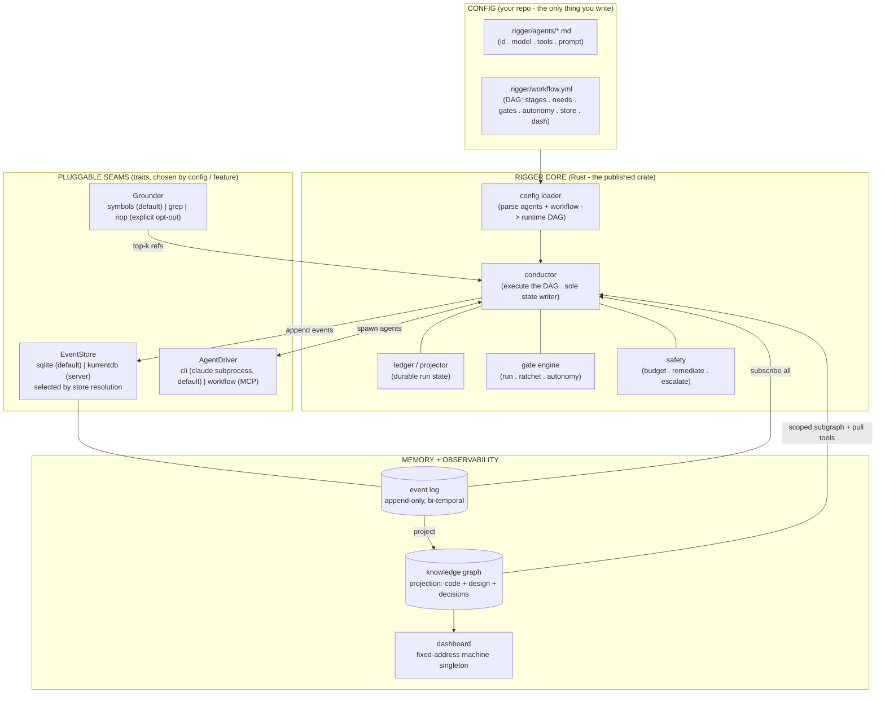
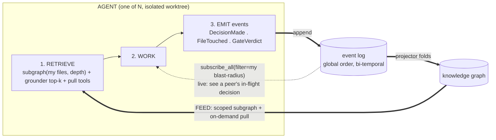

# Rigger: Reference Architecture & Blueprint

> **Status:** Reference architecture. **[AS-BUILT] (implemented in Rust).**
> **Subject:** `Rigger`, a standalone, general-purpose, multi-agent development-loop
> harness, published as a public Rust crate (`cargo install --git https://github.com/virtual-velocitation/rigger`).
> **Scope:** the complete blueprint to reproduce the harness from scratch: the
> orchestration core, the declarative config model (agent files + workflow YAML), the
> event-sourced knowledge-graph memory layer, the read-only observability dashboard, and
> the pluggable seams (event store, agent driver, grounder).
>
> **This is Rigger's canonical architecture doc.** It is the front door and the top of
> the documentation tree: it orients a newcomer to the system that exists today and links
> to the deep-dive addenda. Every claim here is grounded in the current source under
> `src/` and the commands the binary actually exposes. The proposed records in the ADR
> section stay PROPOSALS until ratified; they are not yet written into `docs/adr/`.
>
> **This document is self-contained.** It explains, in its own words, the problem each
> design solves; a reader needs no other repository, product, or history to follow it.
>
> **Addenda (the deep dives; this document orients and links):**
> - [Pit of Success](architecture-addendum-pit-of-success.md) - makes rigger's existing
>   guarantees reachable, visible, validated, and self-documenting; records the
>   load-bearing decisions (base default, cross-run graph, gate authority) that must not
>   be naively "fixed".
> - [Context Management](architecture-addendum-context-management.md) - keeps the context
>   graph correct and bounded as it grows: disposition-expiry, safe dedup, sleep-phase
>   consolidation, and one unified event-sourced knowledge graph (code + design intent +
>   decisions) surfaced in the dash; records the invariants (event-log-is-truth, project-
>   and run-scoping, safe-superset recall) that must not be naively "fixed".
> - [Loop Execution at Scale](architecture-addendum-loop-execution-at-scale.md) - runs a
>   campaign as a dependency-scheduled, self-healing fleet of worktree-isolated runs (fractal
>   isolation: the run is to the campaign what the unit is to the run), keeps the driving
>   binary current with the source it integrates, and right-sizes parallelism to the host.
> - [Concept Graph](architecture-addendum-concept-graph.md) - the project-agnostic concept
>   layer: an event-sourced derivation that groups the code and design-intent nodes into the
>   ideas a project is about, so the graph can be read at the altitude of a concept.
> - [Graph Inspector](architecture-addendum-graph-inspector.md) - the human-facing
>   knowledge-graph inspector: three lenses as an abstraction ladder, subject-by-lens
>   re-projection, directed call queries with conservative resolution, and the rationale
>   overlay ("why is this here?").
> - [Grounding as a Tool](architecture-addendum-grounding-as-tool.md) - pushes only the small
>   deterministic intent layer into an agent's prompt and serves the large reference bulk on
>   demand through a real graph query tool, removing a measured push-truncation defect.
> - [The Resident Conductor](architecture-addendum-resident-conductor.md) - one resident
>   rigger process per project owns the run and parents every subprocess it starts, ending
>   work by handle instead of inference; the socket is the singleton, the store gets one
>   writer, and the command line (and the workflow's couriers) become clients.

---

## How to read this

Sections tagged **[AS-BUILT]** describe what the Rigger crate now implements: what a
section specifies is code you can read under `src/`. The single sentence that frames
the whole design:

> **Rigger is dev-loop *machinery* with the project cut out: every project-specific
> thing (a particular language, build tool, memory system, gate, or codebase) is
> user-supplied *content* (agent files, a workflow YAML, gate commands), and Rigger
> itself ships knowing none of it.**

The reader who wants the 5-minute version: section 1 (what it is) -> section 2 (the
picture) -> section 3 (the declarative model) -> section 5 (the memory layer). The
reader reproducing it: read all of it.

---

## 1. What Rigger is, and what it is not

**Rigger turns a *spec* into *integrated code* by orchestrating a fleet of AI agents,
and it remembers every decision they make in a self-reinforcing knowledge graph so the
next agent is never blind to what the last one decided.** It is the *producing* loop
(spec -> code); an adversarial *review* loop is a stage inside it.

**It is:**
- A **single Rust binary** (cargo-installable) + a **public Rust crate** (`cargo install --git ...` / a library dependency).
- **Language-/project-agnostic.** It knows nothing about your build tool, test runner,
  tracker, or domain. You bring those as config.
- **Declarative.** The agents are **definition files**; the flow is a **workflow YAML**
  shaped like a GitHub Actions DAG. Reconfiguring the loop is an *edit*, never a recompile.
- **Memory-first.** An embedded **event store** (the append-only truth) projects a
  **bi-temporal knowledge graph** (the queryable map) that scopes each agent's context to
  *exactly* its blast-radius and makes concurrent agents aware of each other's decisions.

**It is NOT:**
- Tied to any one editor or agent runtime. The default agent driver shells out to the
  `claude` CLI as a subprocess; running *inside* an editor's workflow tool (over an MCP
  server) is an *optional* driver, not a requirement.
- Tied to a database server. The default event store is embedded SQLite (zero-dependency,
  single file). A shared server backend is compiled into every build behind the same trait
  and selected **by configuration**, never a recompile (section 5.1.1).
- Opinionated about your gates. A gate is "a command that must exit 0" plus an autonomy
  level. `cargo test`, `go test`, `pytest`, `npm test`, a custom lint: all just YAML.

### The machinery / content split (why "no current config exists")

```
        what any dev loop contains                 where it lives in Rigger
   +---------------------------------+     +------------------------------+
   | MACHINERY  (general)            |     | MACHINERY  ->  the Rigger crate|
   |  conductor . ledger . DAG .     | ==> |  (Rust: conductor, eventstore, |
   |  gates . autonomy . fan-out .   |     |   contextgraph, drivers, ...)  |
   |  review . knowledge graph       |     +------------------------------+
   +---------------------------------+     +------------------------------+
   | CONTENT   (project-specific)    | ==> | CONTENT  ->  YOUR repo's config|
   |  project gates . project        |     |  agents/*.md . .rigger/*.yml . |
   |  memory . code corpus . review  |     |  gate commands . grounding src |
   |  lenses . the spec              |     |  (this repo is one EXAMPLE)    |
   +---------------------------------+     +------------------------------+
```

The split is the whole design: the loop's mechanics are generic and live in the
crate; everything the loop must know about a particular project arrives as that
project's configuration. Nothing in the crate names a language, a build tool, or
a codebase - which is why a fresh checkout of Rigger contains no working config,
only the machinery and a worked example.

---

## 2. Architecture at a glance  **[AS-BUILT]**


```mermaid
flowchart TB
  subgraph CFG["CONFIG (your repo - the only thing you write)"]
    AG[".rigger/agents/*.md<br/>(id . model . tools . prompt)"]
    WF[".rigger/workflow.yml<br/>(DAG: stages . needs . gates . autonomy . store . dash)"]
  end

  subgraph CORE["RIGGER CORE (Rust - the published crate)"]
    direction TB
    LOADER["config loader<br/>(parse agents + workflow -> runtime DAG)"]
    COND["conductor<br/>(execute the DAG . sole state writer)"]
    LEDGER["ledger / projector<br/>(durable run state)"]
    GATES["gate engine<br/>(run . ratchet . autonomy)"]
    SAFE["safety<br/>(budget . remediate . escalate)"]
    LOADER --> COND
    COND --- LEDGER & GATES & SAFE
  end

  subgraph SEAMS["PLUGGABLE SEAMS (traits, chosen by config / feature)"]
    direction LR
    ES["EventStore<br/>sqlite (default) | kurrentdb (server)<br/>selected by store resolution"]
    DR["AgentDriver<br/>cli (claude subprocess, default) | workflow (MCP)"]
    GR["Grounder<br/>symbols (default) | grep | nop (explicit opt-out)"]
  end

  subgraph MEM["MEMORY + OBSERVABILITY"]
    LOG[("event log<br/>append-only, bi-temporal")]
    CG[("knowledge graph<br/>projection: code + design + decisions")]
    DASH["dashboard<br/>fixed-address machine singleton"]
    LOG -->|project| CG
    CG --> DASH
  end

  CFG --> LOADER
  COND <-->|spawn agents| DR
  COND -->|append events| ES
  ES --- LOG
  LOG -->|subscribe all| COND
  CG -->|scoped subgraph + pull tools| COND
  GR -->|top-k refs| COND
```

**Three hard seams, one philosophy:** *the core depends on traits; the impls are
chosen by config or cargo feature:*

| Seam | Trait | Default impl | Optional impl | Chosen by |
|---|---|---|---|---|
| **EventStore** | `append` / `read_stream` / `read_all` / `subscribe_all` | `sqlite` (embedded, 1 file) | `kurrentdb` (server backend) | **store resolution** (section 5.1.1): a flag, an env var, a secret file, or the committed `store:` selection - never a recompile |
| **AgentDriver** | `spawn(agent, prompt, opts, emit) -> result` | `cli` (`claude` subprocess) | `workflow` (MCP shim) | the `--driver` flag / config |
| **Grounder** | `ground(query, k) -> Vec<Ref>` | `symbols` (structural; the unset default, shipped in the default build) | `grep` (self-contained substring search) and `nop` (the explicit, named-only opt-outs) | cargo feature + config |

---

## 3. The declarative model: the heart of "reconfigure by editing, not coding"  **[AS-BUILT]**

Two file kinds, both in the *consuming* repo. Rigger reads them; it ships neither.

### 3.1 Agent definition files: `.rigger/agents/<id>.md`

Markdown-with-YAML-frontmatter, so an agent definition drops in verbatim.

```markdown
---
id: implementer
model: sonnet
tools: [Read, Edit, Write, Grep, Glob, Bash]
isolation: worktree          # run in an isolated git worktree
recurse: false               # no Agent tool => cannot fan out (runaway-proof)
---
You implement ONE fully-specified finding inside your worktree. Write the failing
test first, confirm RED, implement minimally, confirm GREEN, run the named gates,
commit, push. Report the final line as JSON: {"id","pass","evidence"}.
```

The agent file is a **pure capability + persona declaration**, with no flow logic. The flow
references it by `id`.

### 3.2 The workflow YAML: `.rigger/workflow.yml`

GitHub-Actions-shaped: a DAG of **stages**, each with `needs:` edges, each binding an
**agent**, optional **gates**, and an **autonomy** level. *This* is the loop: the
stage sequence an orchestrator would normally hardcode
(`ground -> plan -> red -> green -> verify -> review -> integrate`) is data anyone can
rewrite. Two top-level keys configure the machinery around the loop: `store:` selects the
event-store backend (section 5.1.1) and `dash:` opts the always-on dashboard in or out
(section 7).

```yaml
# .rigger/workflow.yml - a GitHub-Actions-style DAG for the producing loop
name: produce-from-spec
on: { spec: { path: "specs/**.md" } }      # what kicks off a run

store:                                      # the committed event-store selection (section 5.1.1)
  backend: sqlite                           # sqlite (default) | kurrentdb (shared server)
  # url: kurrentdb://db.internal:2113       # optional NON-SECRET host/port for the server backend;
                                            # credentials never ride this committed file
dash: on                                    # on (default) | off (suppress the always-on dash)

defaults:
  autonomy: manual                          # manual | auto_notify | silent
  grounder: symbols                         # symbols (default) | grep | nop (explicit opt-out)

  # The three-tier review panel, declared ONCE and applied to every implementer
  # unit. Each unit reviews ITSELF with this panel inside its own lifecycle (section 4.1).
  review:
    lenses: [reviewer.architecture, reviewer.technical]   # tier 1: the expert lenses (parallel)
    adversary: devils-advocate              # tier 2: refutes the lenses (higher bar; not a lens)
    adjudicator: chief-judge                # tier 3: neutral judge; verdict gates the unit

gates:                                      # reusable gate library (commands)
  build:   { run: "cargo build",                    kind: core }
  test:    { run: "cargo test",                     kind: core }
  lint:    { run: "cargo clippy -- -D warnings",    kind: elevated }
  custom:  { run: "./scripts/my-invariant.sh",      kind: elevated }

stages:
  plan:
    agent: planner
    produces: dag                           # decomposes the spec into a unit DAG
    coverage: required                      # block if a spec criterion has no unit

  # Each unit runs its WHOLE lifecycle here: implement (red -> green in a worktree) ->
  # the unit's gates -> three-tier review OF THIS UNIT -> integrate. A reject or a gate
  # failure feeds back into this same unit's remediation loop; it integrates only on
  # approve + green gates (on_pass: merge).
  implement:
    needs: [plan]
    agent: implementer
    strategy: fan-out                       # one agent per ready unit, in worktrees
    partition: by-blast-radius              # disjoint batches => safe parallelism
    gates: [build, test, lint, custom]      # red -> green enforced; the full final set
    on_pass: merge                          # land + reindex + record, per unit
```

**The YAML -> runtime mapping** (loader, section 4.1): each `stage` becomes a node in the
run DAG; `needs` are the edges; `strategy: fan-out` + `partition` triggers the partitioner +
the AgentDriver per unit; `gates` are looked up in the `gates:` library and run via the
gate engine; `autonomy` seeds that gate/stage's ratchet. A stage with `produces: dag`
runs an agent whose output *extends* the run DAG (the living-DAG / `spawnUnit` mechanic).
`defaults.review` is the three-tier panel every implementer unit reviews itself with; a
stage's own `review:` block overrides it.

**The three-tier review is PER UNIT, not a downstream stage.** Review and integration
happen *inside each implementer unit's lifecycle* (section 4.1) - there is no separate
`review` or `integrate` stage. Once a unit's own gates are green, it reviews ITSELF
through the effective `review` panel (the stage's override, else `defaults.review`), in
three tiers, in order:

1. **Lenses** (`review.lenses: [...]`) - the expert reviewers (architecture,
   technical/sdet, ...) review *this unit's diff* in parallel and emit their findings to
   the log.
2. **Adversary** (`review.adversary: <id>`) - a single agent that runs AFTER the lenses
   and reviews *the lenses' output* and the diff, trying to **prove the lenses wrong**: it
   holds them to a HIGHER bar, surfaces the substantive issues all the lenses missed, and
   refutes lens overreach. It reviews the reviews - it is **not** a parallel lens, and it
   does **not** render the final verdict.
3. **Adjudicator** (`review.adjudicator: <id>`) - the **neutral final judge**. It weighs
   the expert lenses against the adversary and decides who wins: **approve**, or **reject
   with specific actionable feedback**. **Its verdict GATES the unit's integration**: an
   explicit reject blocks the merge no matter what the static gates say, and feeds the
   unit back into its own remediation loop.

So per unit the conductor runs: **implement -> the unit's gates -> lenses (parallel) ->
adversary (if present) -> adjudicator (if present, verdict gates) -> integrate**. All
three tiers are optional and compose; an empty panel runs no per-unit review. Every
planner-proposed unit inherits `defaults.review` automatically.

**Risk-tiered review depth (opt-in).** A `review` block may carry an optional `tiers:`
depth policy to right-size the panel to each unit's *observable* risk - the grounded
blast-radius size against a `threshold`, whether any blast-radius file matches a
`high_risk_paths` glob, and whether the unit's gates *flapped* (needed remediation).
Any high-risk signal runs the full panel; only a small, low-path, first-pass-green unit
runs a reduced `light` roster. Risk signals **fail safe**: when risk cannot be measured
(an empty grounded blast radius), the unit routes to the **full** panel, never `light`.
The **adjudicator and the full gate suite stay mandatory on every tier**. With no `tiers:`
block every unit runs the full panel, so existing workflows are unchanged.

### 3.3 Gates are config, not code

A gate is `{ run: <command>, kind: core|elevated|deferred }`. Rigger runs it, captures a
**compact summary** (verdict + a few failing lines, capped), never the raw log, and feeds
that to the autonomy ratchet. `cargo test` / a project lexical check / `pytest` are all
just entries in a project's `gates:` map. Rigger ships **zero** gates.

---

## 4. The execution model: the conductor  **[AS-BUILT]**

### 4.1 The pipeline, now *declared*

A fixed pipeline bakes one team's process into the tool. Rigger's `conductor::run`
(`src/conductor.rs`) instead executes whatever DAG the workflow YAML declares: it
topo-sorts the stages, runs the ready set wave by wave (independent stages concurrently),
defers the coverage gate past a `produces` planner stage, trips the budget breaker before
each wave, and projects the final `RunState`. The canonical pipeline above is simply the
*default* workflow shipped as an example.

**Review and integration are per UNIT, inside each unit's lifecycle.** Every implementer
unit runs its OWN complete lifecycle in `run_single_stage`: ground -> implement (red ->
green TDD in a worktree) -> the unit's gates -> the three-tier review OF THIS UNIT'S DIFF
(lenses -> adversary -> adjudicator) -> integrate. A reject or a gate failure feeds back
into that same unit's remediation loop (re-ground, re-implement with the feedback) and
escalates after the retry bound; it does NOT integrate.


```mermaid
flowchart LR
  S["spec"] --> RDY{"loop-ready?<br/>(enumerable<br/>Done-when criteria)"}
  RDY -->|no| BLK1["block: ask for criteria"]
  RDY -->|yes| G["ground each unit (JIT)<br/>grounder top-k + graph subgraph + pull tools"]
  G --> P["run the DAG stage-by-stage<br/>(needs = edges)"]
  P --> COV{"coverage gate<br/>every criterion has a unit?"}
  COV -->|gap| BLK2["block: plan missed a requirement"]
  COV -->|ok| PAR["partition ready units<br/>(disjoint by blast-radius)"]
  PAR --> FAN["fan-out: AgentDriver per unit"]
  subgraph UNIT["each unit's lifecycle (run_single_stage)"]
    IMPL["implement<br/>(red -> green)"] --> GATES["the unit's gates"]
    GATES -->|green| REV["three-tier review of THIS unit<br/>(lenses -> adversary -> adjudicator)"]
    GATES -->|red| REMED
    REV -->|approve| INT["integrate<br/>commit . land . emit events . reindex"]
    REV -->|reject| REMED["remediate<br/>(re-ground, re-implement;<br/>escalate after N)"]
    REMED --> IMPL
  end
  FAN --> IMPL
  INT --> CONV{"converged?<br/>all criteria covered +<br/>all units integrated +<br/>all gates green"}
  CONV -->|no| G
  CONV -->|yes| DONE["done (machine-verified)"]
```

**"done" is a machine-verifiable predicate:** every spec criterion covered + every unit
integrated + every gate green. Never "looks done."

### 4.2 Durable state: the ledger *is* a projection of the event log

A mutable state file invites two failure modes: concurrent writers race and corrupt it,
and a crash loses everything since the last write. Rigger avoids both with a
one-mutation-authority discipline (only the conductor writes run state) and by making the
ledger a **projection of the event log** (section 5): the run's state (units, lifecycle,
attempts, the integrating commit, evidence) is *derived* by folding the run events, so a
crashed/compacted run resumes by replaying. `conductor::run` folds the existing `run`
stream up front and skips units already integrated. The Conductor is the sole writer of
*projections*; agents only ever *append events*.

```rust
// src/ledger.rs - RunState is projected from the event log by folding the run
// events; the conductor is the only writer. `ledger::project(events)` rebuilds it.
pub struct RunState {
    pub units: BTreeMap<String, Unit>,
    pub spec_defect: bool,        // a coverage gap was flagged
}
pub struct Unit {
    pub id: String,
    pub spec_criterion: String,   // every unit maps to a criterion (anti-fragmentation)
    pub depends_on: Vec<String>,  // the units this one needs (BLOCKS edges)
    pub status: Status,           // Pending | Grounding | Red | Green | Verified |
                                  // Reviewed | Integrated | Failed | Escalated
    pub worktree: String,
    pub branch: String,
    pub evidence: BTreeMap<String, String>, // red / green / verify / review summaries
    pub attempts: u32,
    pub commit: String,           // the integrating commit, once it lands
}
```

**Resume-continuity: the per-unit branch is the durable checkpoint.** A unit's worktree
branch is **deterministic**, derived purely from its id: `rigger/u/<unit-id>`
(`unit_branch`). The same unit reuses the same branch on every run, and a git branch ref
survives process death and worktree removal - making the branch, not the transient
temp-dir worktree, the checkpoint. On resume, `RunCtx::resume_phase` reads the unit's last
recorded `Status` from the folded log AND whether its branch carries committed work, and
continues mid-stream:

| Recorded status + branch          | Resume behavior                                         |
| --------------------------------- | ------------------------------------------------------- |
| `reviewed` (approved) + has work  | skip implement AND review; integrate directly           |
| `green` / `verified` + has work   | skip the implementer spawn; re-run gates + three-tier review on the committed code |
| below `green`, or branch empty/missing | the full lifecycle (implement -> gates -> review -> integrate), unchanged |

A unit's branch is deleted **only after a successful integrate**. An **interrupted** unit
(pause, escalation, error, or crash before integrate) keeps its branch, which is exactly
what the next window reuses.

### 4.3 The autonomy ratchet (bidirectional, self-correcting)

Per gate: `manual -> auto_notify -> silent` on N consecutive clean passes (proposed, never
auto-applied); any non-manual gate that **fails** auto-demotes to `manual`. Autonomy tracks
demonstrated reliability: a graduated gate can never become a silent hole that auto-passes
bad work. The async manual-gate queue lets *independent* units advance while one waits on a
human.

### 4.4 Safety rails and recovery

`checkBudget` (token/time circuit-breaker -> pause), `remediate` (bounded retry with
re-grounding -> escalate after N), `flagSpecDefect` (halt + amend the spec, don't
deviate), `abortTask` (discard un-integrated worktrees, keep integrated). Never silent,
never infinite.

Two recovery behaviors keep a long fleet moving without a human babysitting it:

- **Reviewer re-park.** A review-stage spawn that dies to an *external* fault (a killed
  process, an infrastructure blip) never rendered a verdict, so its work was never judged.
  The conductor DISCARDS that dead spawn and RE-PARKS a FRESH attempt of the same review,
  bounded, rather than charging the reviewed unit a bogus remediation attempt. A genuine
  agent RESULT (approve or reject) is never a fault - only a killed reviewer re-parks.
- **Self-healing worktrees.** A unit's deterministic branch is the checkpoint (section
  4.2), so the transient worktree directory is disposable. If a leftover worktree dir or a
  stale worktree registration is found where a fresh one should be created, the conductor
  reconciles it (removes the orphaned dir, re-creates from the branch) instead of failing -
  a crashed run's debris never wedges the next window.

---

## 5. The memory layer: event source + knowledge graph  **[AS-BUILT: the heart]**

Without a shared, persistent memory, a multi-agent loop fails in two characteristic ways.
Concurrent agents contradict each other, because neither can see what a peer decided
moments ago in the next worktree over. And every agent (and every run) starts amnesiac,
because decisions, review findings, and hard-won lessons evaporate with the session that
produced them. The memory layer removes both failure modes. The model, in one line:
**agents append immutable events to a log; a projector folds the log into a bi-temporal
knowledge graph; agents retrieve their connected subgraph, pull deeper facts on demand,
and subscribe for in-flight decisions.**

### 5.1 The event store: the log is the source of truth

The trait exposes the small set of primitives an event-sourced memory needs: per-stream
append under optimistic concurrency, a global order over all streams, per-stream reads,
and catch-up subscriptions that replay then go live. Both backends implement exactly this,
so swapping backends is a configuration change, not an architecture change.

```rust
// src/eventstore/mod.rs
pub trait EventStore: Send + Sync {
    /// Append events to the end of a stream under an optimistic-concurrency
    /// expectation, reporting what was ACTUALLY written: one slot per event handed in,
    /// in input order, carrying the position the store itself issued. A failed
    /// expectation yields `Error::Conflict { stream, expected, actual }`.
    fn append(&self, stream: &str, expected: ExpectedRevision, events: &[Event])
        -> Result<Appended, Error>;

    /// Read one stream's events from a per-stream revision, in a direction.
    fn read_stream(&self, stream: &str, from: Revision, dir: Direction)
        -> Result<Vec<Event>, Error>;

    /// Read the global log from a position, in a direction, filtered: the projector's input.
    fn read_all(&self, from: Position, dir: Direction, filter: &Filter)
        -> Result<Vec<Event>, Error>;

    /// Open a catch-up subscription over the global log: replay matching events from
    /// `from`, then deliver new ones live (the live-awareness mechanism).
    fn subscribe_all(&self, from: Position, filter: &Filter) -> Result<Subscription, Error>;

    /// Open a catch-up subscription over one stream from a revision.
    fn subscribe_stream(&self, stream: &str, from: Revision) -> Result<Subscription, Error>;
}

pub type Position = u64; // global order, store-assigned on append
pub type Revision = i64; // per-stream position, 0-based; an empty stream is NO_STREAM (-1)

pub struct Event {
    pub id: String,            // a fresh UUID per event
    pub stream: String,        // the stream it belongs to (store-stamped on append)
    pub type_: String,         // "DecisionMade", "FileTouched", "GateVerdict", ...
    pub data: Vec<u8>,         // the opaque (usually JSON) payload
    pub meta: BTreeMap<String, String>, // causation / correlation / actor
    pub valid_from: SystemTime,  // bi-temporal valid-time: when the fact became true
    pub recorded_at: SystemTime, // store-stamped ingest time
    pub position: Position,    // global order (store-assigned on append)
    pub revision: Revision,    // per-stream order (store-assigned on append)
}

pub enum ExpectedRevision { Any, NoStream, Exact(Revision) }
pub struct Filter { pub stream_prefix: Option<String> }
```

**Two impls, one trait (both [AS-BUILT]):**
- **`sqlite` (default).** One table `events` with `UNIQUE(stream, revision)`; the global
  order is `ORDER BY position`; the per-stream uniqueness constraint gives optimistic
  concurrency. Subscriptions poll `MAX(position)` onto an mpsc channel from a background
  thread; at Rigger's event volume this is trivial. Backed by bundled `rusqlite`; zero
  external service; one file under `.rigger/`.
- **`kurrentdb` (the server backend, compiled into every build).** A thin adapter over an
  event-sourcing server's client, bridging its async gRPC API onto the sync port through a
  runtime: `append` -> append-to-stream, `read_all` -> the global read, `subscribe_all` ->
  a filtered catch-up subscription. It connects eagerly and **fails fast on an unreachable
  server**. It carries **no build-time feature flag** - it is always in the binary and
  chosen by store resolution (section 5.1.1), so a consumer of the default build can point
  at a shared team store without a recompile.

Because the trait is the same for both, the contract suite
(`eventstore::contract::assert_contract`: revision assignment, append ordering,
optimistic-concurrency conflicts that carry `actual`, meta/valid_from round-trip, catch-up
replay-then-live) runs against **both** backends - the SQLite impl in-process, and the
server adapter against a real server via testcontainers in the `kurrentdb` CI job. One
suite, two backends green.

### 5.1.1 The store as configuration: one resolution authority  **[AS-BUILT]**

Which backend a command uses is **pure configuration behind a single resolution
authority** (`main::store_selection` / the pure `store_selection_at`). Every command - and
every worker's bare `rigger result` - resolves the SAME store with no per-command flag, so
a run's state never fractures across two stores. The authority reads a fixed precedence,
highest first:

1. **An explicit flag** on `run`: `--eventstore sqlite|kurrentdb`, or a bare `--conn <url>`
   which selects the server addressed verbatim by it. `--eventstore sqlite` wins outright.
2. **The `KURRENTDB_CONN` environment variable** - the full connection string, so a bare
   command in a shell or CI configured for the server resolves it with no flag.
3. **The per-machine secret file `.rigger/store.conn`** - one line, the full connection
   string (credentials included). It is `.gitignore`-d (per-developer, never committed),
   its world-readable permission is warned about, and any connection string that surfaces
   in a message is scrubbed through the crate's single redaction authority (`redact_conn`
   / `endpoint_label`), which masks `user:password@` userinfo while keeping the host.
4. **The committed project `store:` selection** (`config::StoreConfig`: the `store.backend`
   field is `sqlite` or `kurrentdb`, with an optional non-secret `store.url` host/port). The
   CHOICE rides the repo so every member resolves the same backend; **credentials never ride
   this committed file** - only the choice and an optional non-secret address do.
5. **The embedded sqlite store as the default** when nothing selects otherwise, so a project
   that configures nothing behaves exactly as it always has.

Selecting the server by any rung without a resolvable connection string is a clear error
that names all three credential channels. A present-but-unreadable secret file or config
surfaces LOUDLY, never a silent fall-through to the sqlite default (a silent wrong-store
fallback is the exact fracture this authority guards against).

**Projections stay local and rebuildable regardless of backend.** The knowledge graph and
the progress view are folds Rigger maintains locally under `.rigger/` from the resolved
stream, whatever the log backend is - so even a shared server never shares a graph, and any
projection is thrown away and rebuilt from the log at will (event sourcing's superpower).

### 5.1.2 Per-project segregation (one mechanism, every backend)  **[AS-BUILT]**

Event streams and the knowledge graph are **scoped to one project by default**, never
shared. `cargo install` puts the *binary* on a shared PATH, but its *data* is always
project-local, enforced by **one mechanism for every backend**: a **project namespace
applied to stream names**, via a single scoping decorator over the `EventStore` port
(`eventstore::namespace::Namespaced`). The decorator prefixes every stream with its
`proj-<project>-` namespace and scopes every read/subscribe filter to it, so callers use
plain stream names and never see the namespace. SQLite realizes the filter on the `stream`
column; the server backend realizes it as a server-side global filter, so one server backs
many projects, each seeing only its own events. The namespace **defaults to the project
identity** (the git top-level basename), so the composition root wraps the chosen backend
in `Namespaced` before injecting it, and every `rigger run` is scoped without any caller
action. A hard multi-tenant boundary is just config: a dedicated file, or a dedicated
server instance.

### 5.2 The knowledge graph: a bi-temporal projection of the target project

The graph is a **read model** the projector maintains by folding the global log. It is,
first, a **knowledge graph** - it holds a project's *knowledge*: its **code** structure,
its **design intent**, and the **decisions** that shaped it. Event sourcing is the
persistence mechanism underneath, not the framing.

```rust
// src/contextgraph/mod.rs
pub struct Node {
    pub id: String,                       // stable id (entity-resolved)
    pub kind: String,                     // "decision" | "artifact" | "concept" | "lesson" | ...
    pub attrs: BTreeMap<String, String>,
}
pub struct Edge {
    pub from: String,
    pub to: String,
    pub rel: String,                      // DECIDED | SUPERSEDES | TOUCHES | GOVERNS | CALLS |
                                          // REFERENCES | IN_COMMUNITY | REALIZES | ABOUT | ...
    pub valid_from: i64,                  // bi-temporal validity interval ...
    pub valid_to: Option<i64>,            // ... None = still valid; Some = invalidated (NOT deleted)
    pub source: Position,                 // the event that asserted this edge (provenance)
}
pub trait Projection: Send + Sync {
    fn apply(&self, e: &Event) -> Result<(), Error>;
    fn subgraph(&self, seed: &[String], depth: i64) -> Result<Graph, Error>;
    fn resolve(&self, mention: &str) -> Result<Option<String>, Error>;
}
```

**Three properties carried through the fold:**
1. **Bi-temporal freshness.** Supersession sets `valid_to` on the old edge and appends a
   new one: the graph shows the *current* truth, the log keeps the *history*, and a stale
   fact never surfaces with false confidence. `subgraph` filters to live edges by default.
2. **Entity resolution.** `resolve` collapses aliases (`"the editor"` and `"content-editor"`)
   to one node via the alias table on ingest, so retrieval joins instead of fragmenting; an
   unresolved mention becomes a node marked for later merge, never silently dropped.
3. **Scoped retrieval.** `subgraph(seed, depth)` returns the *connected subgraph* of an
   agent's blast-radius (ALL and ONLY its context), not a chunk dump.

**The graph models the target project, not the harness.** When the tool that builds a
project records its own run into the same log, a naive fold would drag the builder's
machinery - agent personas, work units, gates, agent-touched-file edges - into the graph as
noise on the project the graph is *about*. So that machinery is removed **at the fold**: the
projection stops folding those event arms into nodes and edges, everywhere the graph is read
(dash, grounding, blast-radius). This is a **fold-level scoping** (what the projection
includes), not a capability removal: every excluded fact remains in the event log and in the
**run-tree** view, whose proper job is "what the build is doing". The decision/finding/lesson
*content* stays (only the builder-agent attribution drops), so the rationale overlay (section
5.4) is unaffected. The graph-inspector addendum linked above gives the full treatment.

### 5.3 The derivations: coupling communities and intent concepts  **[AS-BUILT]**

Two higher-altitude views of the graph are **event-sourced offline derivations** - not
request-time computations, which would jitter the view on every poll and break the
rebuildable-projection invariant. Each runs as a deterministic pass over the projection and
records its result as events, so a rebuild reproduces it byte-identically:

- **Coupling communities** (`rigger graph communities`, `src/community.rs`) - community
  detection over the call/reference edges, seeded over a deterministic edge ordering, emitting
  `IN_COMMUNITY` membership edges at a chosen resolution grain. This is "which functions
  actually work together", a different grouping from the directory tree.
- **Intent concepts** (`rigger graph concepts`, `src/concepts.rs`) - a grouping over the
  design-intent layer into the ideas a project is *about* ("the grounding pipeline"), emitting
  concept nodes and `REALIZES` membership edges, labelled deterministically with a
  model-assisted refinement that has a deterministic fallback.

Until a derivation has run, its lens renders a documented "not built yet - run the pass"
state, never an error. The concept-graph addendum linked above covers the concept
derivation in depth.

### 5.4 The inspector: three lenses, subject re-projection, call queries, the "why"

The knowledge graph is read by a human through an **inspector**: one parameterized view
(the `/api/graph` route) with two orthogonal controls plus an overlay. Every capability is
a point in that space, not a separate mode.

**Three lenses: an abstraction ladder.** A lens re-clusters the same nodes at a chosen
altitude, ordered abstract to concrete (`dash::Lens`):

```
  CONCEPTS   what the project is about      lens=concepts   (REALIZES membership - section 5.3)
     |
  CODE       how the code is coupled        lens=code       (IN_COMMUNITY membership - section 5.3)
     |
  FILES      where it literally lives        lens=files      (directory / kind - the default fold)
```

Only the **bucket key** changes across the three (directory path -> coupling community ->
concept membership), so one overview-and-drill machinery renders all three. `lens=files` is
byte-identical to a `lens`-absent request; `lens=code` and `lens=concepts` read the offline
derivations and degrade to a documented "not built yet" state when a derivation has not run.

**Subject x lens re-projection.** The lens re-grains **whatever is selected** (nothing, a
concept, a function, or a file), in place, and the two controls compose freely - every
(subject, lens) cell is defined. A wide re-grain **truncates, it does not lie** (it reuses
the render budget and a "showing N of M" caption); a cross-grain projection **resolves, it
does not trust the id** (a bare cross-file placeholder node is resolved to its *defining*
file, not the referencing one its id encodes).

**Directed call queries: resolve conservatively, never confidently wrong.** When the
subject is a function, two directed questions run over the `CALLS` layer as a store-side
traversal (`Projection::calls`):

- `view=calls` with `dir=down` - the **execution path** (forward: what it calls,
  transitively).
- `view=calls` with `dir=up` - the **call sites** (reverse: who calls it).
- `view=calls` with `dir=both` - both directions from the seed.

A hop auto-continues only through **unambiguous** edges: a same-file call, or a cross-file
call whose name has exactly one definition. A name that resolves to **multiple** definitions
is not followed automatically - it renders as a "**fans out to N candidates - pick one**"
frontier the human expands deliberately (the difference between a real execution path and a
DAG dominated by the wrong same-named definitions). Cycles yield a depth-bounded DAG with
marked back-edges, never an infinite expansion. The view defaults to the resolvable tiers
and offers a per-subject opt-in toggle for the unresolved (external-crate, macro-generated)
tier. Call queries render as a **layered left-to-right DAG**, because the direction of
execution is the point.

**The rationale overlay ("why").** Decisions, findings, and lessons are not a lens - they
are metadata bound to nodes (a decision `ABOUT` a function, a rule that `GOVERNS` a file),
revealed on demand at *any* lens. It is the highest-value view for AI-authored code, where
"why is this here?" is the question a human most needs answered - and it is simply empty,
never an error, on a project with no decisions yet.

The whole inspector is read-only over the store and projection. Its route gets its **own
lazy provider**, opened only when a graph request arrives (a panel load, a drill, a lens
flip, a call query), never on the dashboard's 1.5-second state poll - reading the whole
projection or running a traversal on that cadence would be a quarter-million-edge read per
poll on a large repo. The full design is the graph-inspector addendum linked at the top of
this document.

### 5.5 The ingest: parallel, incremental, project-scoped  **[AS-BUILT]**

Populating the graph from a project's source is one walk-and-content-key authority
(`src/ingest.rs`, `ingest::ingest_project`) that both the live run and the standalone
`rigger graph build` (a cold checkout, no run required) share, so the content key an event
is deduped under can never drift between them. Four properties define it:

- **A project-scoped walk.** It walks the project tree at the repo root and lowers each
  file's structure (code) and rationale (design), scoped to the project - never the harness's
  own machinery.
- **Parallel parse with ordered emit.** The code half parses and lowers files across a
  worker pool (one worker per logical core), yet **emits in sorted file-path order**, so the
  event sequence a sink observes is byte-identical to a serial walk's regardless of
  scheduling. Parallelism is a throughput win that is *observationally invisible* - the
  rebuild-byte-identical discipline holds.
- **Batched fold.** Each file's whole batch is appended in ONE store append and folded in
  ONE graph transaction (`append_and_fold_batch`), because the measured cold-build throughput
  was transaction-cadence bound, not parse-bound - one transaction per file, not per event.
- **Content-keyed skip, project-scoped.** Every event carries a deterministic content key
  `<prefix>/<file>@<hash>#<i>`, a pure function of the batch's bytes (`gc` for code, `gd` for
  design). One predicate (`ingest::project_scoped_replay_keys`, beside the key authority that
  builds that format) decides what a fresh emit is redundant against, and both sinks - the run's
  keyed emit and a cold `graph build` - call it rather than carrying their own copy. It applies
  three rules in order:
  - **Type first.** Only the four derived index types (`CodeEntityExtracted`, `EdgeInferred`,
    `DocConceptExtracted`, `DocLinkExtracted`) are eligible. Every other event is passed over
    whatever its replay key looks like, so no domain event can be dropped by this path and the
    partition is a property of the code, not of a naming convention.
  - **Project scope, not run scope.** The eligible keys are read from the WHOLE stream, because a
    file's content hash does not change because a new run started. A derived index fact is a fact
    about the project's files; run scoping belongs to keys whose recurrence is a property of one
    run (unit lifecycle, gate verdicts, breaker trips), and those still seed from the current run's
    slice. So an unchanged file appends **zero** events on every subsequent run, forever - the log
    stops re-accumulating a re-derivable index.
  - **Latest generation per file, never ever-recorded.** A batch is suppressed only when its hash
    equals the hash of the LATEST batch recorded for that same file. A changed file - **including
    one reverted to content it held at an earlier recorded generation** - differs from its latest
    batch, so it re-emits in full. An ever-recorded key set would match the reverted content's old
    records, re-emit nothing, and strand the graph on a superseded version of that file. What the
    re-emitted batch then RETIRES is a different mechanism's doing, not this rule's, and it covers
    only the code half: a code batch carries a `fresh` head, and the fold's two `fresh` arms are the
    only callers of `supersede_file_edges`, so the file's prior structural edges are retired by that
    spec 29a mechanism. The design half sets no `fresh` head at all, so a re-emitted design batch
    adds its edges without retiring the ones its earlier generation left live.

  The net contract is stated against the LOG, because the log is the only thing this predicate
  decides: after any mix of skipping and re-ingest, the log holds each file's LATEST content
  generation **as the walk lowered it** in full, and only what changed is ever re-emitted. That
  qualifier is load-bearing and the last bullet below is why: the walk's view of a file is not always
  the tree's. Whether the live graph then equals a cold rebuild is a property of the FOLD, not of
  this rule - suppression withholds only an append whose content the log already records: it is
  correct about the LOG, and a lost fold is therefore NOT self-healing by re-ingest, because the
  skip withholds exactly the re-append that would have re-folded it; only the append-and-fold
  authority can heal that half. In each case below, the log stays right while the GRAPH or the TREE
  diverges from it; what follows names some of them and is not a closed enumeration.

  In these three, **no batch is folded for the file at all**. Read "the walk no longer sees it"
  strictly, because the two halves differ: the design half
  reads the LIVE tree (`walk_guarded` + a file read per path), so a path that is gone is gone to it,
  while the code half lowers from a PERSISTED symbols index when the project has one (the last bullet
  below). A path the tree has deleted that such an index still lists IS handed over as a batch, DOES
  reach a suppression decision, and is outside these three:

  - **A file the walk no longer sees.** Retiring a file's structure is driven by that file's OWN
    batch (`supersede_file_edges` runs inside the fold of the batch), and the walk emits no batch for
    a path it no longer holds - so nothing on the ingest path retires that file's nodes or edges.
  - **A file the walk still sees that now extracts to NOTHING** - an ordinary edit that removes its
    last definition and reference. Both halves drop a file whose extraction is empty, so again no
    batch is emitted, no `supersede_file_edges` runs, and that file's prior entities and edges stay
    live. "Extracts to nothing" is measured on what the walk lowered, so on a persisted-index project
    an edit that empties a file leaves the code half emitting the index's batch until the index is
    refreshed. Skipping is not what strands them: re-appending the whole index would not have
    retired them either.
  - **A batch whose APPEND landed but whose FOLD did not.** `append_and_fold_batch` folds
    best-effort by contract - a fold failure never fails an append that already landed durably - so
    the log is right and the graph is behind. The append IS recorded, so a later run correctly skips
    it; healing that half is the append-and-fold authority's obligation, not the skip rule's.

  These two sit outside those three for other reasons:

  - **The design half retires nothing, even when its batch IS folded.** The fold's design arms only
    ensure nodes and add edges; `supersede_file_edges` is reached from the `fresh` code arms alone.
    Deleting a section from a design doc therefore re-emits and re-folds that doc's whole batch and
    still leaves the retired `SPECIFIES` and reference edges live.
  - **A code walk lowered from a PERSISTED symbols index.** The code half loads a persisted index
    when the project has one and only builds a fresh one when it does not, and it derives every
    event from the INDEXED symbols with no read of the file itself. On such a project the batches -
    and therefore the content the suppression decision is made against - describe what that index
    holds rather than what the tree currently holds, so a suppression decision IS made and it is made
    against stale content. This is also why the three above are stated walk-relative: a path the tree
    no longer holds, or one an edit emptied, still yields a NON-empty batch while the index lists it.
    Refreshing the index is `rigger reindex`'s job, not this rule's.

  On the INGEST path the projection deletes nothing, so shedding a removed file's facts is a
  deliberate act (`Projector::prune`), never a consequence of the next ingest. The projection is not
  delete-free overall, and the distinction is worth stating exactly: besides `prune`'s three deletes,
  the fold's `CommunityAssigned` and `ConceptDerived` arms each DELETE the super-nodes of their own
  grain that the same pass just left with no live member (nodes carry no `valid_to`, so removal is
  the only way to retire one - the same node-removal primitive `prune` uses). Both are scoped by
  their grain's id prefix and by `KIND_COMMUNITY` / `KIND_CONCEPT` and guarded on having no live
  member, so neither can reach a file entity or its edges, and neither is reachable from an event of
  the four derived index types.

### 5.6 The loop, concretely: emit, project, retrieve


```mermaid
flowchart LR
  subgraph A["AGENT (one of N, isolated worktree)"]
    R["1. RETRIEVE<br/>subgraph(my files, depth) + grounder top-k + pull tools"]
    W["2. WORK"]
    E["3. EMIT events<br/>DecisionMade . FileTouched . GateVerdict"]
    R --> W --> E
  end
  E ==>|append| LOG[("event log<br/>global order, bi-temporal")]
  LOG ==>|projector folds| CG[("knowledge graph")]
  CG ==>|FEED: scoped subgraph + on-demand pull| R
  LOG -. "subscribe_all(filter=my blast-radius)<br/>live: see a peer's in-flight decision" .-> W
```

**Live awareness, concretely.** An agent's run is wrapped by a **side-car**
(`sidecar::Sidecar`) that holds a `subscribe_all` catch-up subscription, draining matching
`DecisionMade` events in a background thread and keeping only the peer decisions whose
`governs` files intersect the agent's blast-radius. A concurrent agent's in-flight decision
about a shared file reaches the agent **before its next action**, without touching the
agent's files: isolation guards the *files* (worktree), the event stream is the *separate
shared decision channel*. The two are orthogonal - the insight that makes live awareness
safe.

### 5.7 Grounding: structural, and pulled rather than pushed

Grounding seeds each agent with exactly the code and memory it needs, on two axes:

- **Structural (the default).** The pluggable `Grounder` trait (`ground(query, k) -> Vec<Ref>`)
  is served by the `symbols` grounder (behind the `symbols` feature): a deterministic,
  tree-sitter-derived symbol index answering "where is this defined, what references it, what
  does changing this file reach". It is the UNSET default - an unset `defaults.grounder`
  resolves to it and it ships in the default build (the `symbols` cargo feature is on by
  default) - and it serves both a precise/ranked contract for grounding and a safe-superset
  (`structural union grep`) contract for the conductor's partitioning and review-tier routing,
  where under-inclusion is a correctness bug. `grep` (a self-contained literal search, no
  index, no dependency) and `nop` are the explicit, named-only opt-outs, reachable ONLY when a
  workflow writes the name. Selecting a grounder NEVER silently degrades to grep: a binary
  built without the `symbols` feature raises a LOUD error naming the `grounder: grep` escape
  hatch, never a quiet fallback.
- **Relational.** The knowledge graph itself, for the multi-hop questions ("what decisions
  govern these files, who else touches these nodes") that a flat text search structurally
  cannot answer - the lookup surface every agent reads through the same projection and
  traversal the human dash reads.

**Grounding is pulled, not pushed.** Only the small, deterministic **intent layer** is
pushed into an agent's prompt; the large reference bulk is served **on demand** through a
real query tool over the same projection and traversal the human dash reads. Pushing the
whole bulk truncated it by recency (a measured 85% loss); a pull is bounded by the *query*, so
the agent asks for a node's neighbors, a call path, or a file's peers exactly when its work
reaches the point of needing them. The tools are read-only over the projection, which is
rebuildable from the log and namespaced per project, so a pull never crosses a project
boundary. The grounding-as-tool addendum linked at the top of this document records the
measurement and the push/pull split.

---

## 6. The agent driver: pluggable spawning  **[AS-BUILT]**

```rust
// src/conductor.rs
pub trait AgentDriver: Send + Sync {
    /// Spawn one agent to completion. The agent records events it emits during its run by
    /// calling `emit` (the workflow driver wires it to an in-process tool; the cli driver,
    /// a subprocess, cannot call back and ignores it).
    fn spawn(
        &self,
        agent: &AgentDef,
        prompt: &str,
        opts: &SpawnOpts,
        emit: &dyn Fn(&str, serde_json::Value) -> Result<(), Error>,
    ) -> Result<AgentResult, Error>;
}
pub struct SpawnOpts {
    pub dir: String,               // the working dir (an isolated worktree, or "")
    pub isolation: bool,           // whether this spawn runs in an isolated worktree
    pub parallel: bool,            // whether it is one of several concurrent in a fan-out stage
    pub blast_radius: Vec<String>, // the grounded seed files this spawn is scoped to
}
```

The conductor fills `blast_radius` from the same grounding it seeds the prompt with, so the
side-car filters peer decisions against exactly the files the agent was grounded on.

- **`cli` (default, self-contained).** `driver::cli::Driver` spawns the `claude` CLI as a
  subprocess and reads its output. Worktree isolation is Rigger's own (`worktree::Worktree`):
  `git worktree add` before, harvest the branch + remove after. **No editor-runtime
  assumption: works for any `cargo install` user with the `claude` CLI on PATH.** Fan-out is a
  bounded pool of scoped OS threads over disjoint units. A subprocess agent cannot call the
  in-process `emit`, so this driver ignores it.
- **`workflow` (optional).** `driver::workflow::Driver` runs inside an editor's workflow tool
  to keep its built-in parallelism / journaling / resume. The sandbox cannot shell out to a
  binary, so the bridge is **MCP, not a subprocess**: `rigger serve` runs the conductor on a
  background thread and serves an MCP server (`mcpserver::Server`) over stdio exposing
  `rigger_next` / `rigger_result` / `rigger_emit` / `rigger_peers` (and the graph query tool
  of section 5.7). A thin shim loops - next spawn, run it in-process, report the result -
  while agents record decisions live. The Rust core is identical; only the spawn seam changes.

**Runaway-proof by construction:** the implementer agent def declares `recurse: false` (no
Agent/spawn capability), and units are partitioned disjoint, so parallel worktrees cannot
conflict and an agent cannot fan out.

---

## 7. The dashboard: a fixed-address machine singleton  **[AS-BUILT]**

An observer wants ONE place to watch every run on their machine. If each observation point
bound its own address, that view would scatter across an unpredictable set of addresses and
force the observer to hunt for the right one. So `rigger dash` (`src/dash.rs`) binds a
**machine-level singleton at a fixed, stable address**: `http://127.0.0.1:7420/`
(`dash::DEFAULT_PORT`) - a second `rigger dash` recognizes the running singleton and exits
without binding a second one, never searching upward. The loop driver's native step path
(`rigger step`, `ensure_run_dashboard`) targets that SAME fixed singleton: the first step of
a run starts it on `DEFAULT_PORT` and every later step finds it serving and starts none, so a
whole `rigger step` loop shares the one machine dash. (An env override, `RIGGER_DASH_PORT`,
exists only so the fixed address is testable and usable on a box that already has something on
7420; it does not weaken the singleton contract.)

One path is deliberately NOT the fixed singleton, and the doc scopes the claim to say so: the
one-shot `rigger run` driver (`start_run_dashboard` -> `spawn_run_dashboard` ->
`dash::free_port_from(DEFAULT_PORT)`) spawns its OWN per-run dashboard that searches UPWARD
from `DEFAULT_PORT` for a free port, so two concurrent `rigger run` invocations bind 7420 and
7421 - each one-shot run gets a private view for its own lifetime, reaped when that run ends.
The fixed singleton above is the shared, always-on observation point that `rigger dash` and
the `rigger step` loop bind; the port-searching per-run dash is `rigger run`'s private view,
not the machine singleton.

- **An instance registry** (`src/registry.rs`) makes discovery a lookup, not a protocol.
  Every `rigger` invocation that starts or advances a run registers its instance - the
  project identity, the project root, a **credential-free** store identity, and a heartbeat
  it refreshes while it works - as pure discovery metadata under the machine's state
  directory. It is NEVER a source of truth and NEVER holds a credential; its loss is
  harmless, because live instances repopulate it as they heartbeat, and any reader prunes
  entries whose heartbeat has gone stale.
- **Attach-to-stores, run-agnostic reads.** The dash discovers every live instance from the
  registry and attaches to each one's store read-only (`?instance=<id>`), re-resolving a
  shared server through the same store-resolution authority every command uses (the registry
  carries only the credential-free endpoint, never the secret). Its reads are **run-agnostic**:
  it reads whatever runs a store holds, past and present, so a single dash presents every
  project's history without being tied to one run.
- **Always-on, with an opt-out.** The native step path **auto-ensures** the one machine
  singleton is up on every run, so an observer never has to remember to start it. A headless
  or CI run opts out with the documented `dash: off` workflow key (or its `false`/`no`
  synonyms), resolved through the single `Workflow::dash_enabled` authority, or with the
  `RIGGER_NO_DASH` environment variable - either suppresses the ensure entirely, so the run
  proceeds with no dash and no port bind. The singleton self-reaps when the last live instance
  it was serving is gone.

The dashboard reads the SAME projection the agent tools read (section 5.7) - the inspector's
three lenses, call queries, and rationale overlay (section 5.4) are the human face of the
same knowledge graph.

---

## 8. Worked example: a decision superseded, seen by the next agent

A representative episode, and the edges below are the ones the sqlite projector actually
folds. A unit "genericize the modifier pipeline" runs; here is the **event log** it appends
and the **graph** that results.

```jsonc
// stream "run", appended over the unit's life (Position grows globally; meta.actor is
// the acting agent, valid_from is the bi-temporal valid-time).
{ "type":"UnitStarted",   "data":{"id":"mod","unit":"mod","criterion":"core names no domain concept","agent":"impl-mod"} }
{ "type":"DecisionMade",  "meta":{"actor":"impl-mod"},
  "data":{"id":"mod-collapse","summary":"move whole modifier into the domain layer","governs":["core-schema/src/modifier.rs"]},
  "valid_from":"...T10:00Z" }
// ... owner rejects; the split decision supersedes the collapse ...
{ "type":"DecisionMade",  "meta":{"actor":"impl-mod"},
  "data":{"id":"mod-split","summary":"generic FoldRule pipeline in core, domain taxonomy on top",
  "governs":["core-schema/src/modifier.rs"],"supersedes":"mod-collapse"}, "valid_from":"...T11:30Z" }
{ "type":"FileTouched",   "data":{"path":"core-schema/src/modifier.rs","by":"impl-mod"} }
{ "type":"GateVerdict",   "data":{"gate":"boundary-check","pass":true,"artifact":"core-schema/src/modifier.rs"} }
{ "type":"UnitIntegrated","data":{"id":"mod","unit":"mod","commit":"f848b97"} }
```

The projector folds these into the graph:

```
(decision mod-split)    --SUPERSEDES--> (decision mod-collapse)
(decision mod-collapse) --GOVERNS(valid_to=11:30)--> (artifact modifier.rs)   <- invalidated, not deleted
(decision mod-split)    --GOVERNS--> (artifact modifier.rs)
(artifact modifier.rs)  --GATED_BY--> (gate boundary-check)
```

**The payoff, concretely:** the *next* agent that touches `modifier.rs` calls
`subgraph(&["modifier.rs"], 2)` and is handed `mod-split` (current), **not** `mod-collapse`
(invalidated), plus the `boundary-check` gate that governs the file. It cannot re-litigate
the collapse, re-invent a gate-dodge, or work a stale base: three failure classes closed
structurally.

---

## 9. Edge cases & failure modes

| Failure | Handling |
|---|---|
| Spec has no enumerable Done-when criteria | `loop-ready` gate blocks; ask the human to add them (never guess "done") |
| A discovered unit has no `spec_criterion` | `spawnUnit` refuses + emits a `scope_creep` event (anti-fragmentation) |
| A conceptual criterion covered only by a mechanical gate | `coverage` proxy-gap guard => NOT covered; demands a real (LLM-judge) verifier |
| Two concurrent units edit the same file | Partitioner makes batches disjoint by blast-radius; they never share a worktree |
| Agent crashes / hits usage limit mid-spawn | `cli` driver: non-zero exit -> `remediate` (bounded retry, re-grounded) -> escalate |
| A reviewer spawn is killed externally (no verdict) | Reviewer re-park (section 4.4): discard the dead spawn, re-park a fresh attempt, bounded - never a bogus remediation charge on the reviewed unit |
| A leftover / stale worktree dir blocks a fresh one | Self-healing worktree (section 4.4): reconcile from the deterministic branch, never wedge the next window |
| Stale base (a peer landed while I ran) | Integrate does `pull --rebase` + re-runs gates; the graph's `TOUCHES` edges flag the overlap pre-merge |
| Event store append conflict (optimistic concurrency) | `ExpectedRevision` mismatch -> `Error::Conflict { stream, expected, actual }`; re-read, re-project, retry the append |
| Projector falls behind / crashes | The graph is a *pure projection*: rebuild it from the log from position 0; idempotent |
| Superseded decision still in the graph | Bi-temporal `valid_to` set on supersession; `subgraph` filters live edges by default |
| Store selected but no connection string | The store resolver errors and names all three credential channels (`--conn`, `KURRENTDB_CONN`, `.rigger/store.conn`) |
| An unreadable secret file or config | Surfaces LOUDLY; never a silent fall-through to the sqlite default that would fracture the run's store |
| Server backend unreachable | Fail fast at startup with a clear (redacted) error; the `sqlite` default never has this failure mode |
| Gate command itself errors (not just fails) | Gate engine wraps the run; a throwing command -> `{pass:false, evidence:"gate errored: ..."}`; never crashes the loop |
| Budget exhausted mid-run | `checkBudget` circuit-breaker pauses; resume by replaying the ledger projection |

---

## 10. Repo layout & `cargo install` usage  **[AS-BUILT]**

A single Rust crate: a library (`src/lib.rs`) plus a binary (`src/main.rs`), with the ports
and adapters as modules under `src/`. One cargo feature (`symbols`) is ON BY
DEFAULT (`default = ["symbols"]`), so a plain `cargo build` ships the structural grounder;
`--no-default-features` is the deliberate LIGHT opt-out that drops it (leaving the
self-contained `grep` grounder). The server event-store backend has **no** feature flag and is
always in the binary.

```
github.com/virtual-velocitation/rigger
|-- Cargo.toml                   crate "rigger"; features: symbols
|-- src/
|   |-- lib.rs                   the library: re-exports every module
|   |-- main.rs                  the CLI binary + the store-resolution authority
|   |-- conductor.rs             the DAG executor + run loop; the AgentDriver port
|   |-- eventstore/
|   |   |-- mod.rs               the EventStore trait + Event/Position/Revision/Filter + redaction
|   |   |-- sqlite.rs            default adapter (embedded, bundled rusqlite)
|   |   |-- kurrentdb.rs         server adapter (compiled in; chosen by store resolution)
|   |   |-- namespace.rs         per-project segregation decorator (Namespaced)
|   |   |-- contract.rs          the shared contract suite (assert_contract)
|   |-- contextgraph/            the Projection trait + bi-temporal sqlite projector + calls traversal
|   |-- community.rs concepts.rs the offline derivations (coupling communities, intent concepts)
|   |-- ingest.rs                the one parallel, incremental, project-scoped ingest authority
|   |-- dash.rs registry.rs      the fixed-address dashboard singleton + the instance registry
|   |-- driver/                  cli.rs (claude subprocess) + workflow.rs (MCP shim)
|   |-- grounder/                symbols (structural; the default) + grep + nop (opt-out)
|   |-- gate.rs safety.rs ledger.rs config.rs spec.rs worktree.rs sidecar.rs mcpserver.rs
|-- examples/demo/               a worked example: a fictional project's .rigger config
|-- .github/workflows/rust.yml   CI: build-test, install-nolock, kurrentdb jobs
```

```bash
cargo install --git https://github.com/virtual-velocitation/rigger
# the plain install above already ships the symbols structural grounder (default features);
# for a lighter, grep-only build, drop it:
cargo install --git https://github.com/virtual-velocitation/rigger --no-default-features

cd my-project
rigger init                         # scaffold .rigger/workflow.yml + .rigger/agents/
rigger run specs/feature.md         # run the producing loop on a spec
rigger serve                        # run as an MCP server for the in-editor workflow shim
rigger dash                         # the fixed-address observability dashboard (127.0.0.1:7420)
rigger graph build                  # fold the project's source into the graph from a cold checkout
rigger graph communities            # derive the code lens's coupling communities (offline)
rigger graph concepts               # derive the concepts lens's intent grouping (offline)
rigger graph --around modifier.rs   # inspect the knowledge graph (subgraph query)
rigger ground <query> [k]           # the configured grounder's top-k references
rigger validate                     # load + validate the workflow + agents
```

The server event-store backend is compiled into every build and chosen by **store
resolution** (section 5.1.1: a flag, the `KURRENTDB_CONN` environment variable, the
`.rigger/store.conn` secret file, or the committed `store:` selection), never a recompile.
The structural grounder is a cargo feature. Library use (embed the harness)
imports the same modules from the `rigger` crate directly. Storage and the graph live under
`./.rigger/` (per project, like `.git/`), scoped to the project identity so one backend can
hold many projects without their data mixing.

---

## 11. The module map  **[AS-BUILT]**

Where each responsibility lives, and the design move that keeps it project-agnostic:

| crate module | responsibility | the design move |
|---|---|---|
| `conductor` | executes the workflow DAG: planning, waves, the per-unit lifecycle, remediation, recovery | the pipeline is declared in YAML, never hardcoded |
| `ledger` | per-unit run state | a pure fold over the event log - never a second source of truth |
| `gate` | the verification library + the per-gate autonomy ratchet | a gate is any command that must exit 0; rigor is config |
| `safety` | spawn-budget circuit breaker, bounded retry, escalation | every bound is config, never a constant |
| `grounder` | seeds each agent with exactly the code it needs | pluggable: `symbols` (structural; the default), `grep`, `nop` (explicit opt-outs) |
| `eventstore` | the append-only log + the two backends + redaction | one trait; the backend is chosen by store resolution, not a recompile |
| `contextgraph` + `community` + `concepts` | the knowledge graph: code + design + decisions, its derivations, and the directed-call traversal | a rebuildable bi-temporal projection of the log; derivations are event-sourced |
| `ingest` | the one parallel, incremental, project-scoped source fold | one walk-and-key authority the run and `graph build` share |
| `dash` + `registry` | the fixed-address dashboard singleton + machine-global discovery | a singleton over a credential-free registry, not a per-run dash-to-dash protocol |
| `driver/` | spawns and awaits agents | a pluggable seam: `cli` (claude subprocess) or `workflow` (MCP bridge) |
| `examples/demo/` | a complete worked config | the proof that the crate itself ships knowing no project |

---

## 12. Records to ratify during execution

> These are **Rigger's** future records (created in this repo at ratification), embedded
> here as proposals; they are not yet ratified and live nowhere else.

### Proposed `rigger/docs/adr/0001-rigger-architecture.md`

```markdown
# ADR-0001: Rigger, a config-driven, event-sourced multi-agent dev-loop harness

- Status: Proposed
- Context: We need a standalone, publishable harness that turns a spec into integrated
  code via a fleet of AI agents while owning none of any consumer's project specifics.
- Decision: Rigger is governed by:
  - R1 CONFIG-OVER-CODE: agents are definition files; the flow is a workflow YAML (a DAG);
    gates are commands. Reconfiguring the loop never recompiles the binary.
  - R2 EVENT-SOURCED MEMORY: an append-only event log is the single source of truth; all
    run state and the knowledge graph are projections folded from it (rebuildable, resumable).
  - R3 BI-TEMPORAL KNOWLEDGE GRAPH: decisions are first-class nodes with validity intervals;
    superseded facts are invalidated, never deleted; retrieval returns a connected subgraph,
    not a chunk dump.
  - R4 PLUGGABLE SEAMS: EventStore (sqlite default | kurrentdb server), AgentDriver (cli
    default | workflow), Grounder (symbols default | grep | nop) are traits chosen by
    configuration / cargo feature; the core depends only on the traits.
  - R5 ORTHOGONAL ISOLATION: worktree isolation guards FILES; the event stream is the shared
    DECISION channel; live cross-agent awareness never crosses the file boundary.
  - R6 MACHINE-VERIFIABLE DONE: every spec criterion covered + every unit integrated + every
    gate green; failures escalate or bounded-retry, never silently drop, never infinite-spin.
  - R7 SELF-CONTAINED PUBLISH: `cargo install`-able; no runtime dependency on an editor or a
    database server in the default configuration. The server event-store backend is compiled
    into every build and selected purely by store resolution (a flag, an environment variable,
    a per-machine secret file, or the committed `store:` choice); the structural grounder is
    a cargo feature.
  - R8 CLEAN ARCHITECTURE + DI: ports (EventStore/Projection/AgentDriver/Grounder/gate::Runner)
    are traits; the adapters depend inward; use cases depend only on ports; a single
    composition root (`src/main.rs`) constructs the concrete adapters and injects them. No
    globals, no module-level singletons, no type building its own dependencies.
  - R9 PROJECT-SCOPED DATA, ONE MECHANISM: event streams and the knowledge graph are segregated
    per project by a single scoping decorator over the EventStore port, a project namespace
    applied to stream names, identical for every backend. The shared `cargo install` binary
    never implies shared data; the graph is always a local, per-project projection.
  - R10 ONE STORE-RESOLUTION AUTHORITY: exactly one place decides which backend a command uses,
    over a fixed precedence (flag, environment, per-machine secret file, committed `store:`
    choice, sqlite default); credentials never ride the committed file and are redacted through
    a single authority wherever they might surface.
- Consequences: a hardcoded flow, a project-specific concept baked into the core, a mutable
  (non-event-sourced) source of truth, a deleted-not-invalidated fact, a default that requires a
  server/editor, a build-time feature flag for the server backend, a second store-resolution or
  segregation mechanism, or a use case that depends on a concrete adapter instead of a port are
  defects.
```

### Proposed Rigger glossary rows (`rigger/docs/glossary.md`, status `pending ADR-0001`)

| Term | Meaning |
|---|---|
| **Workflow** | the YAML DAG that declares the loop's stages, deps, gates, autonomy, store, dash |
| **Agent def** | a markdown+frontmatter file declaring one agent's model/tools/prompt |
| **Gate** | a command + kind + autonomy; the unit of verification |
| **Event** | an immutable, bi-temporal fact appended to the log (the source of truth) |
| **Knowledge graph** | the projected, bi-temporal read model of a project's code, design intent, and decisions |
| **Lens** | one of three altitudes the inspector reads the graph at (`concepts`, `code`, `files`) |
| **Store resolution** | the single authority that selects the event-store backend from config |
| **Driver** | the pluggable agent-spawning backend (`cli` \| `workflow`) |
| **Side-car** | the per-agent subscription that delivers in-flight cross-agent decisions |

---

## 13. Delivery status

The harness described here is **built**: the crate, the two event-store backends behind one
store-resolution authority, the bi-temporal knowledge graph with its offline derivations and
the three-lens inspector, the conductor and its rails and recovery behaviors, both agent
drivers, the parallel incremental ingest, the fixed-address dashboard singleton, and the demo
example all exist under `src/` and `examples/`. The ADR-0001 + glossary records remain
governance PROPOSALS until ratified; the architecture itself is as-built. The addenda linked
at the top of this document are the deep dives for the subsystems that grew the most since the
original blueprint: the pit-of-success guarantees, context management, loop execution at scale,
the concept graph, the graph inspector, and grounding as a tool.

---

*End of reference architecture.*
